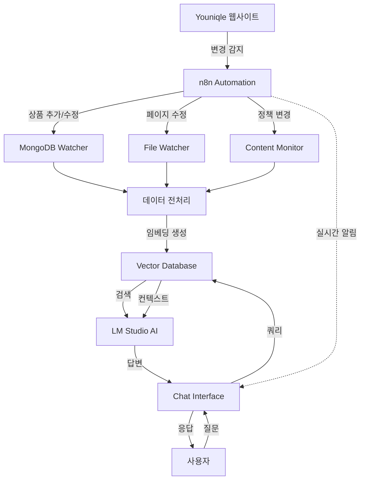

# 🤖 실시간 AI 챗봇 구현 가이드

## 📋 개요

이 가이드는 **n8n + LM Studio**를 활용하여 홈페이지의 모든 변경사항을 실시간으로 모니터링하고, AI가 자동으로 학습하여 사용자와 소통하는 시스템을 구축하는 방법을 설명합니다.

---

## 🎯 핵심 컨셉

### "동적 지식 베이스 기반 실시간 챗봇"

```
홈페이지 변경 → n8n 자동 감지 → AI 지식 업데이트 → 사용자에게 최신 정보 제공
```

### 주요 특징

- ✅ **실시간 모니터링**: 상품, 페이지, 정책 변경 자동 감지
- ✅ **자동 학습**: 변경사항을 AI가 즉시 학습
- ✅ **완전 무료**: OpenAI API 불필요 (LM Studio 사용)
- ✅ **프라이버시**: 모든 데이터 로컬 처리
- ✅ **확장 가능**: 새로운 모니터링 대상 쉽게 추가

---

## 🏗️ 시스템 아키텍처



---

## 💻 기술 스택

### 핵심 컴포넌트

1. **n8n** (무료, 오픈소스)
   - 워크플로우 자동화
   - 데이터 모니터링
   - 웹훅 처리

2. **LM Studio** (무료)
   - 로컬 LLM 실행
   - OpenAI API 호환
   - 한국어 모델 지원

3. **Vector Database**
   - Chroma (로컬, 무료)
   - 또는 Pinecone (클라우드, 유료)

4. **Next.js + Socket.IO**
   - 실시간 채팅 UI
   - WebSocket 통신

---

## 🚀 구현 단계

### Phase 1: 환경 설정 (1일)

#### 1.1 n8n 설치

**Docker 방식 (권장)**
```powershell
# PowerShell에서 실행
docker run -it --rm `
  --name n8n `
  -p 5678:5678 `
  -v ${HOME}\.n8n:/home/node/.n8n `
  n8nio/n8n
```

**npm 방식**
```powershell
npm install n8n -g
n8n start
```

접속: `http://localhost:5678`

#### 1.2 LM Studio 설치

1. https://lmstudio.ai/ 방문
2. Windows 버전 다운로드 및 설치
3. 추천 모델 다운로드:
   - **SOLAR-10.7B-Instruct-v1.0** (한국어 최고)
   - **Mistral-7B-Instruct-v0.2** (범용)

4. Local Server 시작:
   - LM Studio 실행
   - "Local Server" 탭
   - "Start Server" 클릭
   - 엔드포인트: `http://localhost:1234`

#### 1.3 Vector DB 설치

```powershell
# Chroma 설치
pip install chromadb

# 서버 실행
chroma run --host localhost --port 8000
```

---

### Phase 2: n8n 워크플로우 구축 (2-3일)

#### 2.1 MongoDB 모니터링 워크플로우

**목적**: 상품 추가/수정 시 자동으로 AI 지식 베이스 업데이트

**워크플로우 구성**:

```json
{
  "name": "Product Monitor",
  "nodes": [
    {
      "name": "MongoDB Change Stream",
      "type": "n8n-nodes-base.mongoDbTrigger",
      "parameters": {
        "collection": "products",
        "database": "youniqle",
        "operations": ["insert", "update"],
        "options": {
          "fullDocument": "updateLookup"
        }
      }
    },
    {
      "name": "Extract Product Info",
      "type": "n8n-nodes-base.function",
      "parameters": {
        "functionCode": `
          const product = items[0].json.fullDocument;
          return [{
            json: {
              type: 'product',
              action: items[0].json.operationType,
              id: product._id,
              name: product.name,
              price: product.price,
              category: product.category,
              description: product.description,
              stock: product.stock,
              timestamp: new Date().toISOString()
            }
          }];
        `
      }
    },
    {
      "name": "Generate Embedding",
      "type": "n8n-nodes-base.httpRequest",
      "parameters": {
        "url": "http://localhost:1234/v1/embeddings",
        "method": "POST",
        "bodyParameters": {
          "input": "={{$json.name}} {{$json.category}} {{$json.description}}",
          "model": "text-embedding-ada-002"
        }
      }
    },
    {
      "name": "Update Knowledge Base",
      "type": "n8n-nodes-base.httpRequest",
      "parameters": {
        "url": "http://localhost:3000/api/ai/update-knowledge",
        "method": "POST",
        "bodyParameters": {
          "type": "product",
          "data": "={{$json}}",
          "embedding": "={{$json.embedding}}"
        }
      }
    },
    {
      "name": "Notify Chat System",
      "type": "n8n-nodes-base.httpRequest",
      "parameters": {
        "url": "http://localhost:3000/api/ai/notify",
        "method": "POST",
        "bodyParameters": {
          "message": "새 상품이 추가되었습니다: {{$json.name}}"
        }
      }
    }
  ]
}
```

**설정 방법**:
1. n8n 대시보드 접속 (`http://localhost:5678`)
2. "+ Add workflow" 클릭
3. "Import from File" 선택
4. 위 JSON 저장 후 임포트
5. MongoDB 연결 정보 입력
6. "Execute Workflow" 클릭하여 테스트

#### 2.2 파일 시스템 모니터링

**목적**: 페이지 콘텐츠 변경 시 자동 업데이트

```json
{
  "name": "File Watcher",
  "nodes": [
    {
      "name": "Watch Directory",
      "type": "n8n-nodes-base.localFileTrigger",
      "parameters": {
        "path": "F:/youniqle/src/app/**/page.tsx",
        "triggerOn": "changes"
      }
    },
    {
      "name": "Read File Content",
      "type": "n8n-nodes-base.readBinaryFile",
      "parameters": {
        "filePath": "={{$json.path}}"
      }
    },
    {
      "name": "Extract Text",
      "type": "n8n-nodes-base.function",
      "parameters": {
        "functionCode": `
          const content = Buffer.from($binary.data, 'base64').toString('utf8');
          
          // JSX에서 텍스트 추출
          const textMatches = content.match(/>([^<]+)</g);
          const extractedText = textMatches 
            ? textMatches.map(m => m.replace(/>/g, '').replace(/</g, '')).join(' ')
            : '';
          
          return [{
            json: {
              type: 'page',
              path: items[0].json.path,
              content: extractedText,
              timestamp: new Date().toISOString()
            }
          }];
        `
      }
    },
    {
      "name": "Update AI Knowledge",
      "type": "n8n-nodes-base.httpRequest",
      "parameters": {
        "url": "http://localhost:3000/api/ai/update-knowledge",
        "method": "POST",
        "bodyParameters": {
          "type": "page",
          "data": "={{$json}}"
        }
      }
    }
  ]
}
```

#### 2.3 정책 문서 모니터링

**목적**: 정책 문서 변경 시 AI 컨텍스트 자동 업데이트

```json
{
  "name": "Policy Monitor",
  "nodes": [
    {
      "name": "Watch Policy Files",
      "type": "n8n-nodes-base.localFileTrigger",
      "parameters": {
        "path": "F:/youniqle/docs/*.md",
        "triggerOn": "changes"
      }
    },
    {
      "name": "Read Markdown",
      "type": "n8n-nodes-base.readBinaryFile"
    },
    {
      "name": "Parse Content",
      "type": "n8n-nodes-base.markdown",
      "parameters": {
        "operation": "markdownToHtml"
      }
    },
    {
      "name": "Update Policy Context",
      "type": "n8n-nodes-base.httpRequest",
      "parameters": {
        "url": "http://localhost:3000/api/ai/update-knowledge",
        "method": "POST",
        "bodyParameters": {
          "type": "policy",
          "filename": "={{$json.filename}}",
          "content": "={{$json.html}}"
        }
      }
    }
  ]
}
```

---

### Phase 3: AI 통합 (2-3일)

#### 3.1 LM Studio 설정

**모델 선택 기준**:
- **SOLAR-10.7B**: 한국어 이해도 최고, 상담용 추천
- **Mistral-7B**: 속도 빠름, 영어 혼합 시 사용
- **Llama-2-13B**: 복잡한 추론 필요 시

**설정 파일 생성**:

```typescript
// lib/ai/lm-studio-config.ts
export const LMStudioConfig = {
  apiBase: 'http://localhost:1234/v1',
  model: 'solar-10.7b-instruct',
  temperature: 0.7,
  maxTokens: 500,
  topP: 0.9,
  frequencyPenalty: 0.5,
  presencePenalty: 0.5
};
```

#### 3.2 Vector Database 구축

**Chroma DB 초기화**:

```typescript
// lib/ai/vector-db.ts
import { ChromaClient } from 'chromadb';

export class VectorDatabase {
  private client: ChromaClient;
  private collection: any;
  
  async initialize() {
    this.client = new ChromaClient({
      path: 'http://localhost:8000'
    });
    
    this.collection = await this.client.getOrCreateCollection({
      name: 'youniqle_knowledge',
      metadata: {
        description: 'Youniqle 쇼핑몰 지식 베이스'
      }
    });
  }
  
  async addDocument(id: string, text: string, metadata: any) {
    await this.collection.add({
      ids: [id],
      documents: [text],
      metadatas: [metadata]
    });
  }
  
  async search(query: string, topK: number = 5) {
    const results = await this.collection.query({
      queryTexts: [query],
      nResults: topK
    });
    
    return results.documents[0];
  }
  
  async update(id: string, text: string, metadata: any) {
    await this.collection.update({
      ids: [id],
      documents: [text],
      metadatas: [metadata]
    });
  }
}
```

#### 3.3 채팅 시스템 통합

**동적 지식 베이스 챗봇**:

```typescript
// lib/ai/dynamic-chatbot.ts
import { LMStudioConfig } from './lm-studio-config';
import { VectorDatabase } from './vector-db';

export class DynamicKnowledgeChatbot {
  private vectorDB: VectorDatabase;
  private systemPrompt: string;
  
  constructor() {
    this.vectorDB = new VectorDatabase();
    this.initializeSystemPrompt();
  }
  
  private initializeSystemPrompt() {
    this.systemPrompt = `당신은 Youniqle 쇼핑몰의 친절한 커뮤니티 도우미입니다.

회사 정보:
- 이름: 주식회사 사피에넷
- 대표: 장범진
- 전화: 1577-0729
- 이메일: suchwawa@sapienet.com

당신의 역할:
1. 고객 질문에 친절하게 답변
2. 상품 추천 및 안내
3. 주문/배송 문의 처리
4. 실시간 최신 정보 제공

답변 원칙:
- 존댓말 사용
- 이모지 활용 (😊 🎁 📦)
- 항상 최신 정보 기반
- 불확실하면 담당자 연결 제안

현재 시각: ${new Date().toLocaleString('ko-KR')}`;
  }
  
  async chat(userMessage: string, context?: any) {
    // 1. Vector Search로 관련 지식 검색
    await this.vectorDB.initialize();
    const relevantDocs = await this.vectorDB.search(userMessage, 5);
    
    // 2. 컨텍스트 구성
    const contextInfo = relevantDocs.join('\n\n');
    
    // 3. LM Studio API 호출
    const response = await fetch(`${LMStudioConfig.apiBase}/chat/completions`, {
      method: 'POST',
      headers: { 'Content-Type': 'application/json' },
      body: JSON.stringify({
        model: LMStudioConfig.model,
        messages: [
          {
            role: 'system',
            content: `${this.systemPrompt}

최신 지식 베이스:
${contextInfo}`
          },
          {
            role: 'user',
            content: userMessage
          }
        ],
        temperature: LMStudioConfig.temperature,
        max_tokens: LMStudioConfig.maxTokens
      })
    });
    
    const data = await response.json();
    return data.choices[0].message.content;
  }
  
  // n8n에서 호출할 지식 업데이트 메서드
  async updateKnowledge(data: any) {
    await this.vectorDB.initialize();
    
    const text = this.formatKnowledgeText(data);
    const id = `${data.type}_${data.id || data.path}`;
    
    await this.vectorDB.update(id, text, {
      type: data.type,
      timestamp: new Date().toISOString(),
      ...data
    });
    
    console.log(`✅ 지식 업데이트 완료: ${data.type}`);
  }
  
  private formatKnowledgeText(data: any): string {
    switch (data.type) {
      case 'product':
        return `상품명: ${data.name}
카테고리: ${data.category}
가격: ${data.price}원
설명: ${data.description}
재고: ${data.stock}개`;
        
      case 'page':
        return `페이지: ${data.path}
내용: ${data.content}`;
        
      case 'policy':
        return `정책: ${data.filename}
내용: ${data.content}`;
        
      default:
        return JSON.stringify(data);
    }
  }
}
```

---

### Phase 4: 채팅 UI 구현 (2일)

#### 4.1 플로팅 챗봇 컴포넌트

```typescript
// components/chat/FloatingChatbot.tsx
'use client';

import { useState, useEffect, useRef } from 'react';
import { io, Socket } from 'socket.io-client';

interface Message {
  id: string;
  role: 'user' | 'assistant' | 'system';
  content: string;
  timestamp: Date;
}

export default function FloatingChatbot() {
  const [isOpen, setIsOpen] = useState(false);
  const [messages, setMessages] = useState<Message[]>([]);
  const [input, setInput] = useState('');
  const [isLoading, setIsLoading] = useState(false);
  const [socket, setSocket] = useState<Socket | null>(null);
  const messagesEndRef = useRef<HTMLDivElement>(null);
  
  useEffect(() => {
    // Socket.IO 연결
    const newSocket = io('http://localhost:3000');
    setSocket(newSocket);
    
    // 실시간 업데이트 수신
    newSocket.on('knowledge_update', (data) => {
      console.log('📚 지식 업데이트:', data);
      
      // 사용자에게 알림
      if (isOpen && data.notify) {
        addSystemMessage(`✨ ${data.message}`);
      }
    });
    
    return () => {
      newSocket.close();
    };
  }, []);
  
  useEffect(() => {
    scrollToBottom();
  }, [messages]);
  
  const scrollToBottom = () => {
    messagesEndRef.current?.scrollIntoView({ behavior: 'smooth' });
  };
  
  const addSystemMessage = (content: string) => {
    setMessages(prev => [...prev, {
      id: Date.now().toString(),
      role: 'system',
      content,
      timestamp: new Date()
    }]);
  };
  
  const sendMessage = async (text: string = input) => {
    if (!text.trim()) return;
    
    const userMessage: Message = {
      id: Date.now().toString(),
      role: 'user',
      content: text,
      timestamp: new Date()
    };
    
    setMessages(prev => [...prev, userMessage]);
    setInput('');
    setIsLoading(true);
    
    try {
      const response = await fetch('/api/chat', {
        method: 'POST',
        headers: { 'Content-Type': 'application/json' },
        body: JSON.stringify({ message: text })
      });
      
      const data = await response.json();
      
      const assistantMessage: Message = {
        id: (Date.now() + 1).toString(),
        role: 'assistant',
        content: data.response,
        timestamp: new Date()
      };
      
      setMessages(prev => [...prev, assistantMessage]);
      
    } catch (error) {
      console.error('Chat error:', error);
      addSystemMessage('죄송합니다. 일시적인 오류가 발생했습니다. 🙏');
    } finally {
      setIsLoading(false);
    }
  };
  
  const quickQuestions = [
    '배송 기간은?',
    '환불 정책',
    '신상품 추천',
    '회원 혜택',
    '파트너 신청'
  ];
  
  return (
    <>
      {/* 플로팅 버튼 */}
      <button
        onClick={() => setIsOpen(!isOpen)}
        className="fixed bottom-6 right-6 w-16 h-16 bg-gradient-to-r from-blue-600 to-blue-500 text-white rounded-full shadow-lg hover:shadow-xl transition-all z-50 flex items-center justify-center group"
      >
        {isOpen ? (
          <span className="text-2xl">✕</span>
        ) : (
          <span className="text-2xl group-hover:scale-110 transition">💬</span>
        )}
      </button>
      
      {/* 채팅 창 */}
      {isOpen && (
        <div className="fixed bottom-24 right-6 w-96 h-[600px] bg-white rounded-2xl shadow-2xl flex flex-col z-50 border border-gray-200">
          {/* 헤더 */}
          <div className="bg-gradient-to-r from-blue-600 to-blue-500 text-white p-4 rounded-t-2xl">
            <div className="flex items-center gap-3">
              <div className="w-10 h-10 bg-white/20 rounded-full flex items-center justify-center">
                🤖
              </div>
              <div>
                <h3 className="font-bold text-lg">커뮤니티 도우미</h3>
                <p className="text-sm opacity-90 flex items-center gap-1">
                  <span className="w-2 h-2 bg-green-400 rounded-full animate-pulse"></span>
                  실시간 응답 중
                </p>
              </div>
            </div>
          </div>
          
          {/* 메시지 목록 */}
          <div className="flex-1 overflow-y-auto p-4 space-y-4 bg-gray-50">
            {messages.length === 0 && (
              <div className="text-center py-8">
                <div className="text-6xl mb-4">👋</div>
                <h4 className="font-bold text-lg mb-2">안녕하세요!</h4>
                <p className="text-gray-600 text-sm">
                  무엇을 도와드릴까요?
                </p>
              </div>
            )}
            
            {messages.map((msg) => (
              <div
                key={msg.id}
                className={`flex ${msg.role === 'user' ? 'justify-end' : 'justify-start'}`}
              >
                <div
                  className={`max-w-[80%] rounded-2xl px-4 py-3 ${
                    msg.role === 'user'
                      ? 'bg-blue-600 text-white rounded-br-none'
                      : msg.role === 'system'
                      ? 'bg-yellow-100 text-yellow-800 text-center w-full text-sm'
                      : 'bg-white text-gray-800 shadow-sm rounded-bl-none'
                  }`}
                >
                  <p className="whitespace-pre-wrap">{msg.content}</p>
                  <p className={`text-xs mt-2 ${
                    msg.role === 'user' ? 'text-blue-100' : 'text-gray-400'
                  }`}>
                    {msg.timestamp.toLocaleTimeString('ko-KR', {
                      hour: '2-digit',
                      minute: '2-digit'
                    })}
                  </p>
                </div>
              </div>
            ))}
            
            {isLoading && (
              <div className="flex justify-start">
                <div className="bg-white rounded-2xl px-4 py-3 shadow-sm">
                  <div className="flex gap-1">
                    <span className="w-2 h-2 bg-gray-400 rounded-full animate-bounce" />
                    <span className="w-2 h-2 bg-gray-400 rounded-full animate-bounce delay-100" />
                    <span className="w-2 h-2 bg-gray-400 rounded-full animate-bounce delay-200" />
                  </div>
                </div>
              </div>
            )}
            
            <div ref={messagesEndRef} />
          </div>
          
          {/* 빠른 질문 */}
          {messages.length === 0 && (
            <div className="px-4 pb-2 bg-gray-50">
              <p className="text-xs text-gray-500 mb-2">빠른 질문:</p>
              <div className="flex flex-wrap gap-2">
                {quickQuestions.map((q, i) => (
                  <button
                    key={i}
                    onClick={() => sendMessage(q)}
                    className="text-xs bg-white hover:bg-blue-50 border border-gray-200 hover:border-blue-300 px-3 py-2 rounded-full transition"
                  >
                    {q}
                  </button>
                ))}
              </div>
            </div>
          )}
          
          {/* 입력창 */}
          <div className="p-4 bg-white border-t rounded-b-2xl">
            <div className="flex gap-2">
              <input
                type="text"
                value={input}
                onChange={(e) => setInput(e.target.value)}
                onKeyPress={(e) => e.key === 'Enter' && sendMessage()}
                placeholder="메시지를 입력하세요..."
                className="flex-1 border border-gray-300 rounded-full px-4 py-2 focus:outline-none focus:border-blue-500 focus:ring-2 focus:ring-blue-200"
                disabled={isLoading}
              />
              <button
                onClick={() => sendMessage()}
                disabled={isLoading || !input.trim()}
                className="bg-blue-600 text-white p-2 rounded-full hover:bg-blue-700 transition disabled:opacity-50 disabled:cursor-not-allowed w-10 h-10 flex items-center justify-center"
              >
                <span className="text-xl">→</span>
              </button>
            </div>
          </div>
        </div>
      )}
    </>
  );
}
```

---

## 📊 테스트 시나리오

### 테스트 1: 상품 추가 모니터링

```powershell
# 1. 모든 서비스 실행 확인
# - Next.js: localhost:3000
# - n8n: localhost:5678
# - LM Studio: localhost:1234
# - Chroma: localhost:8000

# 2. MongoDB Compass로 상품 추가
{
  "name": "테스트 상품",
  "price": 50000,
  "category": "전자제품",
  "description": "실시간 모니터링 테스트용 상품",
  "stock": 100
}

# 3. n8n 로그 확인
# → "Product Monitor" 워크플로우 자동 실행 확인

# 4. 채팅에서 질문
"신상품 있나요?"

# 5. 기대 결과
AI: "네! 방금 '테스트 상품'이 추가되었습니다. 
가격은 50,000원이고, 전자제품 카테고리입니다. 
현재 재고는 100개 남아있어요! 😊"
```

### 테스트 2: 페이지 수정 감지

```powershell
# 1. 페이지 파일 수정
# src/app/about/page.tsx 수정

# 2. n8n "File Watcher" 워크플로우 자동 실행

# 3. 채팅에서 질문
"회사 소개 페이지가 어떻게 바뀌었나요?"

# 4. AI가 최신 내용 기반 응답
```

### 테스트 3: 정책 변경 반영

```powershell
# 1. docs/REFUND_POLICY.md 수정
# 환불 기간: 7일 → 14일

# 2. n8n "Policy Monitor" 워크플로우 실행

# 3. 채팅 질문
"환불 기간이 얼마죠?"

# 4. 기대 결과
AI: "환불은 상품 수령 후 14일 이내 가능합니다! 
(최근 정책이 변경되어 7일에서 14일로 연장되었습니다 🎉)"
```

---

## 🐛 트러블슈팅

### 문제 1: n8n에서 MongoDB 연결 실패

**증상**: "Connection timeout" 에러

**해결**:
```powershell
# MongoDB 연결 문자열 확인
# .env.local의 MONGODB_URI 복사

# n8n 워크플로우에서:
# MongoDB Trigger → Credentials → Edit
# Connection String에 MONGODB_URI 입력
# Test Connection 클릭
```

### 문제 2: LM Studio 응답 없음

**증상**: 채팅 시 무한 로딩

**해결**:
```powershell
# 1. LM Studio 서버 상태 확인
curl http://localhost:1234/v1/models

# 2. 모델이 로드되었는지 확인
# LM Studio UI → Models → Loaded

# 3. 서버 재시작
# LM Studio → Local Server → Stop → Start
```

### 문제 3: Vector DB 검색 결과 없음

**증상**: AI가 "모르겠습니다" 응답

**해결**:
```powershell
# 1. Chroma DB 확인
curl http://localhost:8000/api/v1/collections

# 2. 지식 베이스 재구축
npm run seed:knowledge

# 3. 임베딩 재생성
# n8n에서 모든 워크플로우 수동 실행
```

---

## 📈 성능 최적화

### CPU/메모리 사용량 줄이기

```typescript
// LM Studio 설정 최적화
{
  "n_threads": 4,           // CPU 스레드 제한
  "n_batch": 512,           // 배치 크기 조정
  "n_gpu_layers": 0,        // GPU 없을 시 0
  "context_length": 2048    // 컨텍스트 길이 제한
}
```

### 응답 속도 개선

```typescript
// 캐싱 전략
const responseCache = new Map();

async function getCachedResponse(query: string) {
  const cacheKey = query.toLowerCase().trim();
  
  if (responseCache.has(cacheKey)) {
    return {
      ...responseCache.get(cacheKey),
      cached: true
    };
  }
  
  const response = await chatbot.chat(query);
  responseCache.set(cacheKey, response);
  
  return response;
}
```

---

## 🚀 프로덕션 배포 가이드

### 로컬 → 프로덕션 전환

| 컴포넌트 | 로컬 | 프로덕션 |
|----------|------|----------|
| n8n | localhost:5678 | n8n Cloud 또는 Docker 호스팅 |
| LM Studio | localhost:1234 | GPU 서버 + LM Studio CLI |
| Vector DB | 로컬 Chroma | Pinecone 또는 Weaviate Cloud |
| MongoDB | Atlas (이미 클라우드) | 동일 |
| Next.js | localhost:3000 | Vercel (grigobio.co.kr) |

### 프로덕션 체크리스트

- [ ] n8n 클라우드 또는 자체 호스팅 설정
- [ ] GPU 서버에 LM Studio 배포
- [ ] 환경 변수 프로덕션 값으로 변경
- [ ] WebSocket CORS 설정
- [ ] Rate Limiting 적용
- [ ] 모니터링 설정 (Sentry, LogRocket)
- [ ] 백업 전략 수립

---

## 💰 비용 분석

### 로컬 개발 (무료)
```
n8n: $0 (오픈소스)
LM Studio: $0 (로컬)
Chroma: $0 (로컬)
총: $0/월
```

### 프로덕션 (최소 비용)
```
n8n Cloud: $0 (무료 플랜) 또는 $20/월
GPU 서버 (Vast.ai): $0.20/시간 × 24h × 30일 = $144/월
Pinecone: $0 (무료 플랜) 또는 $70/월
총: $20-234/월
```

### 프로덕션 (OpenAI 사용 시)
```
n8n: $20/월
OpenAI API: $50-200/월
Pinecone: $70/월
총: $140-290/월
```

---

## 📚 추가 자료

### 공식 문서
- n8n: https://docs.n8n.io/
- LM Studio: https://lmstudio.ai/docs
- Chroma: https://docs.trychroma.com/
- SOLAR Model: https://huggingface.co/upstage/SOLAR-10.7B-Instruct-v1.0

### 추천 학습 자료
- n8n 유튜브 채널
- LM Studio Discord 커뮤니티
- Chroma GitHub Examples

---

## 🎯 다음 단계

1. ✅ 환경 설정 완료
2. ✅ n8n 워크플로우 구축
3. ✅ AI 통합 완료
4. ✅ 채팅 UI 구현
5. 🔄 테스트 및 최적화
6. 🚀 프로덕션 배포

---

**이 가이드로 완전 무료로 실시간 AI 챗봇을 구축할 수 있습니다!** 🎉

질문이나 문제가 있으면 GitHub Issues에 남겨주세요.


