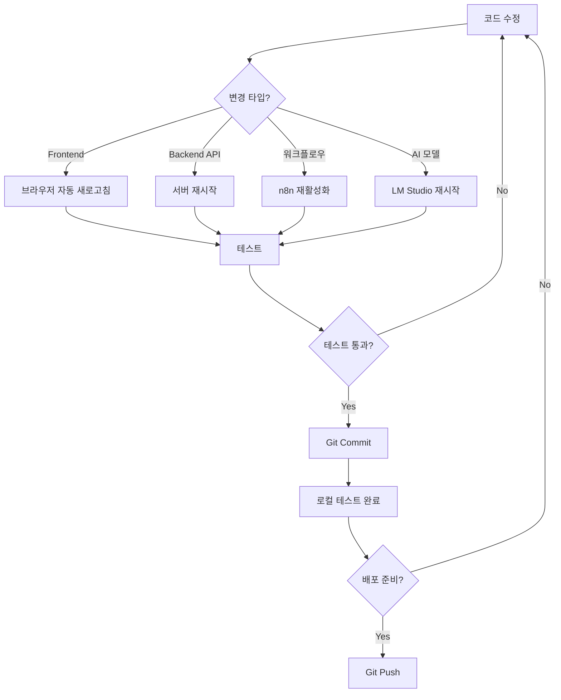

# 💻 로컬 개발 환경 설정 가이드

## 📋 목차

1. [시작하기 전에](#시작하기-전에)
2. [로컬 환경 설정](#로컬-환경-설정)
3. [테스트 시나리오](#테스트-시나리오)
4. [개발 워크플로우](#개발-워크플로우)
5. [트러블슈팅](#트러블슈팅)
6. [FAQ](#faq)

---

## 🎯 시작하기 전에

### 필수 요구사항

#### 하드웨어
- **CPU**: 4코어 이상 (인텔 i5/AMD Ryzen 5 이상)
- **RAM**: 최소 8GB (16GB 권장)
- **디스크**: 20GB 이상 여유 공간
- **GPU**: 선택사항 (LM Studio 속도 향상)

#### 소프트웨어
- **Windows 10/11** (현재 환경)
- **Node.js**: 18.x 이상
- **Docker Desktop**: 최신 버전 (선택사항)
- **MongoDB**: Atlas 또는 로컬
- **Git**: 2.30 이상

#### 네트워크
- 인터넷 연결 (초기 설정 시)
- 방화벽 포트 개방:
  - 3000 (Next.js)
  - 5678 (n8n)
  - 1234 (LM Studio)
  - 8000 (Chroma)

---

## 🚀 로컬 환경 설정

### Step 1: 기존 프로젝트 확인 (5분)

```powershell
# 프로젝트 디렉토리로 이동
cd F:\youniqle

# 현재 상태 확인
git status

# 의존성 확인
npm list --depth=0

# 환경 변수 확인
Get-Content .env.local
```

**기대 결과**:
```
✓ Node.js 버전: v18.x 이상
✓ MongoDB 연결: 정상
✓ .env.local 파일 존재
✓ node_modules 존재
```

---

### Step 2: n8n 설치 및 실행 (10분)

#### 옵션 A: Docker 사용 (권장)

```powershell
# 1. Docker Desktop 설치 확인
docker --version

# 2. n8n 컨테이너 실행
docker run -d `
  --name n8n-local `
  -p 5678:5678 `
  -v ${HOME}\.n8n:/home/node/.n8n `
  -e N8N_BASIC_AUTH_ACTIVE=true `
  -e N8N_BASIC_AUTH_USER=admin `
  -e N8N_BASIC_AUTH_PASSWORD=admin123 `
  n8nio/n8n

# 3. 로그 확인
docker logs -f n8n-local

# 4. 브라우저에서 확인
Start-Process "http://localhost:5678"
```

#### 옵션 B: npm 설치

```powershell
# 1. 전역 설치
npm install n8n -g

# 2. 환경 변수 설정 (PowerShell)
$env:N8N_BASIC_AUTH_ACTIVE = "true"
$env:N8N_BASIC_AUTH_USER = "admin"
$env:N8N_BASIC_AUTH_PASSWORD = "admin123"

# 3. 실행
n8n start

# 4. 백그라운드 실행 (선택)
Start-Process powershell -ArgumentList "n8n start" -WindowStyle Hidden
```

#### 초기 설정

1. 브라우저에서 `http://localhost:5678` 접속
2. 계정 생성 또는 로그인 (admin/admin123)
3. "Get Started" 클릭
4. 기본 설정 완료

---

### Step 3: LM Studio 설치 및 설정 (20분)

#### 다운로드 및 설치

```powershell
# 1. LM Studio 다운로드
Start-Process "https://lmstudio.ai/"
# → Windows 버전 다운로드
# → lmstudio-installer.exe 실행

# 2. 설치 완료 후 실행
```

#### 모델 다운로드

```
LM Studio UI에서:

1. "Search" 탭 클릭
2. 검색창에 "SOLAR" 입력
3. "upstage/SOLAR-10.7B-Instruct-v1.0" 찾기
4. "Download" 클릭
   - 크기: ~7GB
   - 시간: 10-20분 (인터넷 속도에 따라)

추가 권장 모델:
- "mistralai/Mistral-7B-Instruct-v0.2"
- "meta-llama/Llama-2-7b-chat"
```

#### Local Server 시작

```
1. "Local Server" 탭 클릭
2. 모델 선택: SOLAR-10.7B-Instruct-v1.0
3. "Start Server" 버튼 클릭
4. 서버 주소 확인: http://localhost:1234
5. "Server Running ✓" 표시 확인

설정:
- Context Length: 4096
- Temperature: 0.7
- Top P: 0.9
- Max Tokens: 500
```

#### 테스트

```powershell
# PowerShell에서 API 테스트
$headers = @{
    "Content-Type" = "application/json"
}

$body = @{
    "model" = "solar-10.7b-instruct"
    "messages" = @(
        @{
            "role" = "user"
            "content" = "안녕하세요?"
        }
    )
} | ConvertTo-Json

Invoke-RestMethod -Uri "http://localhost:1234/v1/chat/completions" `
  -Method Post `
  -Headers $headers `
  -Body $body
```

**기대 결과**:
```json
{
  "choices": [
    {
      "message": {
        "role": "assistant",
        "content": "안녕하세요! 무엇을 도와드릴까요?"
      }
    }
  ]
}
```

---

### Step 4: Vector Database 설치 (5분)

#### Chroma 설치

```powershell
# 1. Python 확인
python --version
# 없으면 Python 3.9+ 설치: https://www.python.org/

# 2. Chroma 설치
pip install chromadb

# 3. 서버 실행
chroma run --host localhost --port 8000 --path ./chroma-data

# 4. 테스트
Invoke-RestMethod -Uri "http://localhost:8000/api/v1/heartbeat"
# 응답: {"status": "ok"}
```

#### 대안: 임베디드 모드 (서버 불필요)

프로젝트에 직접 통합하여 별도 서버 없이 사용:

```typescript
// lib/ai/vector-db-embedded.ts
import { ChromaClient } from 'chromadb';

const client = new ChromaClient({
  path: './data/chroma'  // 로컬 파일 시스템 사용
});
```

---

### Step 5: 환경 변수 설정 (3분)

#### .env.local 업데이트

```powershell
# 기존 .env.local 백업
Copy-Item .env.local .env.local.backup

# 에디터로 열기
code .env.local
```

#### 추가할 환경 변수

```env
# ========================================
# AI Chatbot Configuration
# ========================================

# n8n
N8N_URL=http://localhost:5678
N8N_API_KEY=your-random-api-key-here
N8N_WEBHOOK_URL=http://localhost:5678/webhook

# LM Studio
LM_STUDIO_URL=http://localhost:1234/v1
LM_STUDIO_MODEL=solar-10.7b-instruct
LM_STUDIO_TEMPERATURE=0.7
LM_STUDIO_MAX_TOKENS=500

# Vector Database
CHROMA_URL=http://localhost:8000
CHROMA_COLLECTION=youniqle_knowledge

# AI Features
AI_CHATBOT_ENABLED=true
AI_AUTO_LEARNING=true
AI_DEBUG_MODE=true
```

#### API Key 생성

```powershell
# 랜덤 API Key 생성
[Convert]::ToBase64String([System.Text.Encoding]::UTF8.GetBytes([Guid]::NewGuid().ToString()))
```

---

### Step 6: 프로젝트 실행 (2분)

```powershell
# 1. Next.js 개발 서버 시작
npm run dev

# 2. 브라우저 확인
Start-Process "http://localhost:3000"

# 3. 모든 서비스 상태 확인
Write-Host "=== 서비스 상태 체크 ===" -ForegroundColor Green
Write-Host "Next.js:    " -NoNewline; Invoke-RestMethod "http://localhost:3000/api/health" -ErrorAction SilentlyContinue
Write-Host "n8n:        " -NoNewline; Invoke-RestMethod "http://localhost:5678" -ErrorAction SilentlyContinue
Write-Host "LM Studio:  " -NoNewline; Invoke-RestMethod "http://localhost:1234/v1/models" -ErrorAction SilentlyContinue
Write-Host "Chroma:     " -NoNewline; Invoke-RestMethod "http://localhost:8000/api/v1/heartbeat" -ErrorAction SilentlyContinue
```

---

## 🧪 테스트 시나리오

### 테스트 1: 전체 시스템 연동 테스트 (5분)

#### 1단계: MongoDB 모니터링 워크플로우 활성화

```powershell
# n8n 접속
Start-Process "http://localhost:5678"

# 워크플로우 임포트
# workflows/product-monitor.json 파일 업로드

# Active 토글 ON
```

#### 2단계: 테스트 상품 추가

```powershell
# MongoDB Compass 또는 API로 테스트 상품 추가
$testProduct = @{
    name = "테스트 상품 - AI 모니터링"
    price = 29900
    category = "전자제품"
    description = "실시간 모니터링 테스트용 상품입니다."
    summary = "AI 챗봇 테스트"
    stock = 100
    status = "active"
} | ConvertTo-Json

Invoke-RestMethod -Uri "http://localhost:3000/api/admin/products" `
  -Method Post `
  -Headers @{"Content-Type"="application/json"} `
  -Body $testProduct
```

#### 3단계: n8n 로그 확인

```powershell
# Docker 사용 시
docker logs n8n-local --tail 50

# npm 사용 시
# n8n 실행 중인 터미널 확인
```

**기대 결과**:
```
[Product Monitor] 추가: 테스트 상품 - AI 모니터링
[Product Monitor] 임베딩 생성 완료
✅ [Product Monitor] 완료
```

#### 4단계: 채팅 테스트

```powershell
# 웹사이트에서 채팅 아이콘 클릭
# 질문: "신상품 있나요?"
```

**기대 응답**:
```
네! 방금 '테스트 상품 - AI 모니터링'이 추가되었습니다.
가격은 29,900원이고, 전자제품 카테고리입니다.
현재 재고는 100개 남아있어요! 😊
```

---

### 테스트 2: 파일 시스템 모니터링 (3분)

#### 1단계: File Watcher 워크플로우 활성화

```powershell
# n8n에서 file-watcher.json 임포트 및 활성화
```

#### 2단계: 테스트 페이지 수정

```powershell
# 테스트용 파일 생성
$testContent = @"
export default function TestPage() {
  return (
    <div>
      <h1>테스트 페이지</h1>
      <p>AI 모니터링 테스트 - $(Get-Date -Format 'yyyy-MM-dd HH:mm:ss')</p>
    </div>
  );
}
"@

Set-Content -Path "src/app/test/page.tsx" -Value $testContent
```

#### 3단계: n8n 로그 확인

```powershell
docker logs n8n-local --tail 20
```

**기대 결과**:
```
[File Watcher] 처리: page.tsx
✅ [File Watcher] 완료
```

---

### 테스트 3: 채팅 기능 전체 테스트 (10분)

#### 테스트 케이스

```typescript
const testCases = [
  {
    question: "배송 기간이 얼마나 걸리나요?",
    expected: "2-3일"
  },
  {
    question: "환불 정책을 알려주세요",
    expected: "7일 이내"
  },
  {
    question: "회원 등급 혜택은?",
    expected: "CEDAR, ROOTER, BLOOMER"
  },
  {
    question: "방금 추가된 상품이 뭔가요?",
    expected: "테스트 상품"
  },
  {
    question: "파트너 신청은 어떻게 하나요?",
    expected: "마이페이지"
  }
];
```

#### 자동 테스트 스크립트

```powershell
# test-chatbot.ps1
$testCases = @(
    @{ question = "배송 기간은?"; keyword = "2-3일" },
    @{ question = "환불 정책은?"; keyword = "7일" },
    @{ question = "회원 혜택은?"; keyword = "등급" }
)

foreach ($test in $testCases) {
    Write-Host "`n질문: $($test.question)" -ForegroundColor Cyan
    
    $body = @{ message = $test.question } | ConvertTo-Json
    $response = Invoke-RestMethod -Uri "http://localhost:3000/api/chat" `
      -Method Post `
      -Headers @{"Content-Type"="application/json"} `
      -Body $body
    
    Write-Host "답변: $($response.response)" -ForegroundColor Green
    
    if ($response.response -match $test.keyword) {
        Write-Host "✓ 테스트 통과" -ForegroundColor Green
    } else {
        Write-Host "✗ 테스트 실패" -ForegroundColor Red
    }
    
    Start-Sleep -Seconds 2
}
```

---

## 🔄 개발 워크플로우

### 일일 개발 루틴

#### 시작 (5분)

```powershell
# dev-start.ps1 스크립트
Write-Host "=== Youniqle AI 챗봇 개발 환경 시작 ===" -ForegroundColor Cyan

# 1. 프로젝트 디렉토리로 이동
cd F:\youniqle

# 2. Git 최신 상태 확인
git pull origin main

# 3. 의존성 업데이트 확인
npm install

# 4. 서비스 시작
Write-Host "`n서비스 시작 중..." -ForegroundColor Yellow

# n8n 시작
Start-Process powershell -ArgumentList "docker start n8n-local" -WindowStyle Hidden

# LM Studio는 수동 시작 (GUI 필요)
Write-Host "LM Studio를 수동으로 시작해주세요." -ForegroundColor Yellow

# Chroma 시작
Start-Process powershell -ArgumentList "chroma run --host localhost --port 8000" -WindowStyle Hidden

# Next.js 시작
Start-Process powershell -ArgumentList "cd F:\youniqle; npm run dev"

# 5. 브라우저 열기
Start-Sleep -Seconds 5
Start-Process "http://localhost:3000"
Start-Process "http://localhost:5678"

Write-Host "`n✓ 개발 환경 준비 완료!" -ForegroundColor Green
```

#### 종료 (2분)

```powershell
# dev-stop.ps1 스크립트
Write-Host "=== 개발 환경 종료 ===" -ForegroundColor Cyan

# n8n 중지
docker stop n8n-local

# Node 프로세스 종료
Get-Process node -ErrorAction SilentlyContinue | Stop-Process -Force

# Chroma 종료
Get-Process python -ErrorAction SilentlyContinue | 
  Where-Object { $_.CommandLine -match "chroma" } | 
  Stop-Process -Force

Write-Host "✓ 모든 서비스 종료 완료" -ForegroundColor Green
```

---

### 코드 변경 시 워크플로우



---

## 🐛 트러블슈팅

### 문제 1: 포트가 이미 사용 중

**증상**:
```
Error: listen EADDRINUSE: address already in use :::3000
```

**해결**:
```powershell
# 포트 사용 중인 프로세스 찾기
netstat -ano | findstr :3000

# PID 확인 후 종료
taskkill /PID <PID> /F

# 또는 모든 Node 프로세스 종료
Get-Process node | Stop-Process -Force
```

---

### 문제 2: MongoDB 연결 실패

**증상**:
```
MongoServerError: connection timeout
```

**해결**:
```powershell
# 1. 연결 문자열 확인
Get-Content .env.local | Select-String "MONGODB_URI"

# 2. MongoDB Atlas 접속 확인
# https://cloud.mongodb.com/

# 3. IP 화이트리스트 확인
# Network Access → IP Access List

# 4. 테스트 연결
mongosh "your-connection-string"
```

---

### 문제 3: n8n 워크플로우가 실행 안 됨

**증상**: 데이터 변경해도 워크플로우 트리거 안 됨

**해결**:
```powershell
# 1. n8n 로그 확인
docker logs n8n-local --tail 50

# 2. 워크플로우 재활성화
# n8n UI → 워크플로우 → Active OFF → ON

# 3. n8n 재시작
docker restart n8n-local

# 4. MongoDB Change Stream 지원 확인
# Atlas M0 (무료) 티어는 Change Stream 미지원!
# M2 이상 필요 또는 대안 사용
```

**대안** (MongoDB Atlas M0 무료 티어):
```json
{
  "name": "Polling Trigger",
  "type": "n8n-nodes-base.interval",
  "parameters": {
    "interval": 60
  }
}
```

---

### 문제 4: LM Studio 응답 느림

**증상**: 채팅 응답에 30초 이상 소요

**해결**:
```
LM Studio 설정:

1. Context Length 줄이기: 4096 → 2048
2. Max Tokens 줄이기: 500 → 200
3. GPU 사용 (가능한 경우)
4. 더 작은 모델 사용:
   - SOLAR-10.7B → Mistral-7B
   - 또는 Llama-2-7B
```

---

### 문제 5: 메모리 부족

**증상**:
```
FATAL ERROR: Reached heap limit Allocation failed
```

**해결**:
```powershell
# 1. Node.js 메모리 증가
$env:NODE_OPTIONS="--max-old-space-size=4096"
npm run dev

# 2. package.json 수정
{
  "scripts": {
    "dev": "set NODE_OPTIONS=--max-old-space-size=4096 && next dev"
  }
}

# 3. 불필요한 프로세스 종료
Get-Process | Where-Object { $_.WorkingSet -gt 500MB } | Stop-Process
```

---

## ❓ FAQ

### Q1: 로컬 개발 시 인터넷이 필요한가요?

**A**: 부분적으로 필요합니다.

```
필요한 경우:
✓ 초기 설정 (모델 다운로드)
✓ MongoDB Atlas 사용 시
✓ npm install

불필요한 경우:
✓ 일반 개발 작업
✓ LM Studio 사용 (로컬 AI)
✓ n8n 워크플로우
```

---

### Q2: Git Push 없이 테스트만 하고 싶어요

**A**: 완전 가능합니다!

```powershell
# 로컬에서만 작업
# 변경사항 커밋하지 않고 테스트
npm run dev

# 만족스러우면 그때 커밋
git add .
git commit -m "feat: AI chatbot"
git push origin main
```

---

### Q3: 프로덕션 배포 전에 꼭 해야 할 일은?

**A**: 체크리스트

```markdown
배포 전 체크리스트:
- [ ] 모든 로컬 테스트 통과
- [ ] 환경 변수 프로덕션 값으로 변경
- [ ] API Key 보안 확인
- [ ] n8n 클라우드 또는 호스팅 준비
- [ ] LM Studio → OpenAI API 또는 GPU 서버
- [ ] Vector DB 클라우드 마이그레이션
- [ ] 에러 로깅 설정 (Sentry)
- [ ] 모니터링 설정
```

---

### Q4: 여러 프로젝트에서 동시에 개발 가능한가요?

**A**: 네, 포트만 변경하면 됩니다.

```powershell
# 프로젝트 A
cd F:\project-a
npm run dev -- -p 3000

# 프로젝트 B
cd F:\project-b
npm run dev -- -p 3001

# n8n은 공유 가능
# LM Studio도 공유 가능
```

---

### Q5: 백업은 어떻게 하나요?

**A**: 자동 백업 스크립트

```powershell
# backup.ps1
$date = Get-Date -Format "yyyyMMdd-HHmmss"
$backupPath = "F:\backups\youniqle-$date"

# 1. n8n 워크플로우 백업
docker exec n8n-local n8n export:workflow --all --output=/data/workflows
Copy-Item "$HOME\.n8n\workflows" $backupPath -Recurse

# 2. Vector DB 백업
Copy-Item ".\chroma-data" $backupPath -Recurse

# 3. 환경 변수 백업
Copy-Item ".env.local" "$backupPath\.env.local.backup"

# 4. 코드 백업 (Git)
git bundle create "$backupPath\repo.bundle" --all

Write-Host "✓ 백업 완료: $backupPath" -ForegroundColor Green
```

---

## 🎯 성능 최적화 팁

### 1. 개발 서버 속도 향상

```powershell
# Next.js Turbopack 사용 (실험적)
npm run dev -- --turbo

# SWC 컴파일러 활성화 (기본)
# next.config.js에서 자동 활성화됨
```

### 2. LM Studio 속도 향상

```
- GPU 사용 (NVIDIA/AMD)
- 모델 양자화 버전 사용 (Q4_K_M)
- Context Length 최소화
- Batch Size 증가
```

### 3. 워크플로우 최적화

```json
{
  "parameters": {
    "options": {
      "debounceWait": 5000,  // 중복 실행 방지
      "batchSize": 10         // 배치 처리
    }
  }
}
```

---

## 📚 유용한 스크립트 모음

### 전체 상태 체크

```powershell
# status-check.ps1
Write-Host "=== 개발 환경 상태 체크 ===" -ForegroundColor Cyan

$services = @(
    @{Name="Next.js"; Url="http://localhost:3000/api/health"},
    @{Name="n8n"; Url="http://localhost:5678"},
    @{Name="LM Studio"; Url="http://localhost:1234/v1/models"},
    @{Name="Chroma"; Url="http://localhost:8000/api/v1/heartbeat"}
)

foreach ($service in $services) {
    try {
        $response = Invoke-RestMethod $service.Url -ErrorAction Stop
        Write-Host "✓ $($service.Name): Running" -ForegroundColor Green
    } catch {
        Write-Host "✗ $($service.Name): Stopped" -ForegroundColor Red
    }
}
```

### 로그 통합 뷰어

```powershell
# logs.ps1
param([string]$Service = "all")

switch ($Service) {
    "n8n" {
        docker logs n8n-local --tail 50 --follow
    }
    "nextjs" {
        Get-Content .next\server\trace -Tail 50 -Wait
    }
    "all" {
        Start-Process powershell -ArgumentList "docker logs n8n-local --follow"
        npm run dev
    }
}
```

---

## 🚀 다음 단계

1. ✅ 로컬 환경 설정 완료
2. ✅ 모든 서비스 정상 작동 확인
3. ✅ 테스트 시나리오 통과
4. 🔄 실제 기능 개발 시작
5. 📊 프로덕션 배포 준비

---

**이 가이드로 로컬 개발 환경을 완벽하게 구축할 수 있습니다!** 💪

추가 질문이나 문제가 있으면 언제든 물어보세요!


