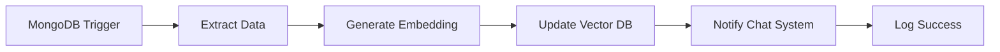

# 🔄 n8n 워크플로우 상세 가이드

## 📋 목차

1. [n8n 기본 개념](#n8n-기본-개념)
2. [워크플로우 설계 원칙](#워크플로우-설계-원칙)
3. [핵심 워크플로우](#핵심-워크플로우)
4. [고급 기능](#고급-기능)
5. [트러블슈팅](#트러블슈팅)

---

## 🎯 n8n 기본 개념

### n8n이란?

**n8n**(n-eight-n)은 노드 기반 워크플로우 자동화 도구입니다.

```
입력(Trigger) → 처리(Transform) → 출력(Action)
```

### 핵심 용어

- **Workflow**: 자동화 흐름 전체
- **Node**: 워크플로우의 각 단계
- **Trigger**: 워크플로우를 시작하는 이벤트
- **Connection**: 노드 간 데이터 흐름
- **Credential**: 외부 서비스 인증 정보

---

## 📐 워크플로우 설계 원칙

### 1. Single Responsibility (단일 책임)

각 워크플로우는 하나의 명확한 목적을 가져야 합니다.

```
❌ 나쁜 예: "모든 데이터 모니터링"
✅ 좋은 예: "상품 추가 모니터링"
✅ 좋은 예: "페이지 수정 감지"
✅ 좋은 예: "정책 변경 추적"
```

### 2. Error Handling (에러 처리)

모든 노드에 에러 핸들링을 추가합니다.

```json
{
  "name": "Error Handler",
  "type": "n8n-nodes-base.errorTrigger",
  "onError": "continueErrorOutput"
}
```

### 3. Logging (로깅)

중요한 단계마다 로그를 남깁니다.

```javascript
// Function 노드에서
console.log('[워크플로우명] 단계명:', JSON.stringify($json, null, 2));
return items;
```

---

## 🔧 핵심 워크플로우

### 워크플로우 1: 상품 모니터링 (Product Monitor)

#### 목적
MongoDB에서 상품 추가/수정 이벤트를 실시간으로 감지하고 AI 지식 베이스에 자동 반영

#### 워크플로우 구조



#### 완전한 워크플로우 JSON

```json
{
  "name": "Product Monitor - Complete",
  "nodes": [
    {
      "parameters": {
        "collection": "products",
        "database": "youniqle",
        "options": {
          "fullDocument": "updateLookup"
        }
      },
      "id": "mongodb-trigger",
      "name": "MongoDB Change Stream",
      "type": "n8n-nodes-base.mongoDbTrigger",
      "typeVersion": 1,
      "position": [250, 300],
      "credentials": {
        "mongoDb": {
          "id": "1",
          "name": "MongoDB Youniqle"
        }
      }
    },
    {
      "parameters": {
        "functionCode": "// 상품 데이터 추출 및 포맷팅\nconst operation = items[0].json.operationType;\nconst product = items[0].json.fullDocument;\n\n// 작업 타입별 처리\nlet action = '';\nswitch(operation) {\n  case 'insert':\n    action = '추가';\n    break;\n  case 'update':\n    action = '수정';\n    break;\n  case 'replace':\n    action = '교체';\n    break;\n  default:\n    action = '변경';\n}\n\n// 로그 출력\nconsole.log(`[Product Monitor] ${action}: ${product.name}`);\n\n// 데이터 포맷팅\nreturn [{\n  json: {\n    type: 'product',\n    action: action,\n    operationType: operation,\n    id: product._id.toString(),\n    name: product.name || '',\n    price: product.price || 0,\n    category: product.category || '미분류',\n    description: product.description || '',\n    summary: product.summary || '',\n    stock: product.stock || 0,\n    status: product.status || 'active',\n    images: product.images || [],\n    timestamp: new Date().toISOString(),\n    \n    // 검색용 텍스트 (임베딩에 사용)\n    searchText: `${product.name} ${product.category} ${product.description} ${product.summary}`.trim()\n  }\n}];"
      },
      "id": "extract-product",
      "name": "Extract Product Data",
      "type": "n8n-nodes-base.function",
      "typeVersion": 1,
      "position": [450, 300]
    },
    {
      "parameters": {
        "url": "http://localhost:1234/v1/embeddings",
        "method": "POST",
        "sendHeaders": true,
        "headerParameters": {
          "parameters": [
            {
              "name": "Content-Type",
              "value": "application/json"
            }
          ]
        },
        "sendBody": true,
        "bodyParameters": {
          "parameters": [
            {
              "name": "input",
              "value": "={{$json.searchText}}"
            },
            {
              "name": "model",
              "value": "text-embedding-ada-002"
            }
          ]
        },
        "options": {
          "timeout": 30000
        }
      },
      "id": "generate-embedding",
      "name": "Generate Embedding",
      "type": "n8n-nodes-base.httpRequest",
      "typeVersion": 3,
      "position": [650, 300],
      "onError": "continueErrorOutput"
    },
    {
      "parameters": {
        "functionCode": "// 임베딩 결과 처리\nconst productData = items[0].json;\nconst embeddingResponse = items[0].json.data;\n\nif (embeddingResponse && embeddingResponse[0]) {\n  productData.embedding = embeddingResponse[0].embedding;\n  console.log(`[Product Monitor] 임베딩 생성 완료: ${productData.name}`);\n} else {\n  console.warn(`[Product Monitor] 임베딩 생성 실패: ${productData.name}`);\n  productData.embedding = null;\n}\n\nreturn [{ json: productData }];"
      },
      "id": "process-embedding",
      "name": "Process Embedding",
      "type": "n8n-nodes-base.function",
      "typeVersion": 1,
      "position": [850, 300]
    },
    {
      "parameters": {
        "url": "http://localhost:3000/api/ai/update-knowledge",
        "method": "POST",
        "sendHeaders": true,
        "headerParameters": {
          "parameters": [
            {
              "name": "Content-Type",
              "value": "application/json"
            },
            {
              "name": "X-API-Key",
              "value": "={{$env.N8N_API_KEY}}"
            }
          ]
        },
        "sendBody": true,
        "bodyParameters": {
          "parameters": [
            {
              "name": "type",
              "value": "product"
            },
            {
              "name": "data",
              "value": "={{JSON.stringify($json)}}"
            }
          ]
        }
      },
      "id": "update-vector-db",
      "name": "Update Vector DB",
      "type": "n8n-nodes-base.httpRequest",
      "typeVersion": 3,
      "position": [1050, 300],
      "onError": "continueErrorOutput"
    },
    {
      "parameters": {
        "url": "http://localhost:3000/api/ai/notify",
        "method": "POST",
        "sendBody": true,
        "bodyParameters": {
          "parameters": [
            {
              "name": "type",
              "value": "product_update"
            },
            {
              "name": "message",
              "value": "새 상품이 추가되었습니다: {{$json.name}}"
            },
            {
              "name": "data",
              "value": "={{JSON.stringify({ id: $json.id, name: $json.name, price: $json.price })}}"
            },
            {
              "name": "notify",
              "value": true
            }
          ]
        }
      },
      "id": "notify-chat",
      "name": "Notify Chat System",
      "type": "n8n-nodes-base.httpRequest",
      "typeVersion": 3,
      "position": [1250, 300]
    },
    {
      "parameters": {
        "functionCode": "// 성공 로그\nconst product = items[0].json;\nconsole.log(`✅ [Product Monitor] 완료: ${product.name}`);\nconsole.log(`   - ID: ${product.id}`);\nconsole.log(`   - 가격: ${product.price}원`);\nconsole.log(`   - 카테고리: ${product.category}`);\nconsole.log(`   - 시각: ${product.timestamp}`);\n\nreturn items;"
      },
      "id": "log-success",
      "name": "Log Success",
      "type": "n8n-nodes-base.function",
      "typeVersion": 1,
      "position": [1450, 300]
    },
    {
      "parameters": {
        "functionCode": "// 에러 로그\nconst error = $json.error || 'Unknown error';\nconsole.error(`❌ [Product Monitor] 에러:`, error);\nconsole.error(`   - 데이터:`, JSON.stringify($json, null, 2));\n\n// 에러를 무시하고 계속 진행\nreturn [];"
      },
      "id": "error-handler",
      "name": "Error Handler",
      "type": "n8n-nodes-base.errorTrigger",
      "typeVersion": 1,
      "position": [850, 500]
    }
  ],
  "connections": {
    "MongoDB Change Stream": {
      "main": [[{ "node": "Extract Product Data", "type": "main", "index": 0 }]]
    },
    "Extract Product Data": {
      "main": [[{ "node": "Generate Embedding", "type": "main", "index": 0 }]]
    },
    "Generate Embedding": {
      "main": [[{ "node": "Process Embedding", "type": "main", "index": 0 }]]
    },
    "Process Embedding": {
      "main": [[{ "node": "Update Vector DB", "type": "main", "index": 0 }]]
    },
    "Update Vector DB": {
      "main": [[{ "node": "Notify Chat System", "type": "main", "index": 0 }]]
    },
    "Notify Chat System": {
      "main": [[{ "node": "Log Success", "type": "main", "index": 0 }]]
    }
  },
  "active": true,
  "settings": {},
  "tags": ["ai", "monitoring", "product"]
}
```

#### 설정 단계

1. **MongoDB Credential 설정**
```
n8n → Credentials → Add Credential → MongoDB
- Connection String: (MongoDB Atlas URI)
- Database: youniqle
- Test Connection ✓
```

2. **워크플로우 임포트**
```
n8n → Workflows → Import from File
→ product-monitor.json 업로드
```

3. **환경 변수 설정**
```bash
# n8n 환경 변수
N8N_API_KEY=your-secret-key
```

4. **활성화**
```
워크플로우 우측 상단 → Active 토글 ON
```

---

### 워크플로우 2: 파일 시스템 모니터링 (File Watcher)

#### 목적
페이지 파일 변경 시 자동으로 콘텐츠 추출 및 AI 업데이트

#### 워크플로우 JSON

```json
{
  "name": "File Watcher - Complete",
  "nodes": [
    {
      "parameters": {
        "path": "F:/youniqle/src/app",
        "triggerOn": "changes",
        "options": {
          "debounceWait": 5000
        }
      },
      "name": "Watch Directory",
      "type": "n8n-nodes-base.localFileTrigger",
      "typeVersion": 1,
      "position": [250, 300]
    },
    {
      "parameters": {
        "functionCode": "// 파일 경로 필터링\nconst filePath = items[0].json.path;\nconst fileName = items[0].json.fileName;\n\n// page.tsx, page.ts, layout.tsx만 처리\nconst validExtensions = ['.tsx', '.ts'];\nconst isPageFile = fileName.includes('page.') || fileName.includes('layout.');\nconst hasValidExtension = validExtensions.some(ext => fileName.endsWith(ext));\n\nif (!isPageFile || !hasValidExtension) {\n  console.log(`[File Watcher] 스킵: ${fileName}`);\n  return [];\n}\n\nconsole.log(`[File Watcher] 처리: ${fileName}`);\n\nreturn items;"
      },
      "name": "Filter Files",
      "type": "n8n-nodes-base.function",
      "typeVersion": 1,
      "position": [450, 300]
    },
    {
      "parameters": {
        "filePath": "={{$json.path}}",
        "dataPropertyName": "fileContent"
      },
      "name": "Read File",
      "type": "n8n-nodes-base.readBinaryFile",
      "typeVersion": 1,
      "position": [650, 300]
    },
    {
      "parameters": {
        "functionCode": "// 파일 내용을 텍스트로 변환\nconst binary = items[0].binary.fileContent;\nconst content = Buffer.from(binary.data, 'base64').toString('utf8');\n\n// JSX/TSX에서 텍스트 추출\nconst extractText = (code) => {\n  // 주석 제거\n  let text = code.replace(/\\/\\*[\\s\\S]*?\\*\\//g, '');\n  text = text.replace(/\\/\\/.*/g, '');\n  \n  // JSX 텍스트 추출\n  const textMatches = text.match(/>([^<>{]+)</g) || [];\n  const extractedTexts = textMatches.map(m => \n    m.replace(/>/g, '').replace(/</g, '').trim()\n  ).filter(t => t.length > 0);\n  \n  // 문자열 리터럴 추출\n  const stringMatches = text.match(/['\"`]([^'\"`]+)['\"`]/g) || [];\n  const extractedStrings = stringMatches.map(m => \n    m.replace(/['\"`]/g, '').trim()\n  ).filter(t => t.length > 3);\n  \n  return [...new Set([...extractedTexts, ...extractedStrings])].join(' ');\n};\n\nconst extractedText = extractText(content);\n\nreturn [{\n  json: {\n    type: 'page',\n    path: items[0].json.path,\n    fileName: items[0].json.fileName,\n    content: extractedText,\n    timestamp: new Date().toISOString(),\n    searchText: `${items[0].json.fileName} ${extractedText}`.trim()\n  }\n}];"
      },
      "name": "Extract Text",
      "type": "n8n-nodes-base.function",
      "typeVersion": 1,
      "position": [850, 300]
    },
    {
      "parameters": {
        "url": "http://localhost:3000/api/ai/update-knowledge",
        "method": "POST",
        "sendBody": true,
        "bodyParameters": {
          "parameters": [
            {
              "name": "type",
              "value": "page"
            },
            {
              "name": "data",
              "value": "={{JSON.stringify($json)}}"
            }
          ]
        }
      },
      "name": "Update AI Knowledge",
      "type": "n8n-nodes-base.httpRequest",
      "typeVersion": 3,
      "position": [1050, 300]
    },
    {
      "parameters": {
        "functionCode": "console.log(`✅ [File Watcher] 완료: ${$json.fileName}`);\nreturn items;"
      },
      "name": "Log Success",
      "type": "n8n-nodes-base.function",
      "typeVersion": 1,
      "position": [1250, 300]
    }
  ],
  "connections": {
    "Watch Directory": {
      "main": [[{ "node": "Filter Files" }]]
    },
    "Filter Files": {
      "main": [[{ "node": "Read File" }]]
    },
    "Read File": {
      "main": [[{ "node": "Extract Text" }]]
    },
    "Extract Text": {
      "main": [[{ "node": "Update AI Knowledge" }]]
    },
    "Update AI Knowledge": {
      "main": [[{ "node": "Log Success" }]]
    }
  },
  "active": true,
  "tags": ["ai", "monitoring", "files"]
}
```

---

### 워크플로우 3: 정책 문서 모니터링 (Policy Monitor)

#### 워크플로우 JSON

```json
{
  "name": "Policy Monitor - Complete",
  "nodes": [
    {
      "parameters": {
        "path": "F:/youniqle/docs",
        "triggerOn": "changes",
        "options": {
          "debounceWait": 3000
        }
      },
      "name": "Watch Docs Folder",
      "type": "n8n-nodes-base.localFileTrigger",
      "typeVersion": 1,
      "position": [250, 300]
    },
    {
      "parameters": {
        "functionCode": "// .md 파일만 처리\nconst fileName = items[0].json.fileName;\n\nif (!fileName.endsWith('.md')) {\n  console.log(`[Policy Monitor] 스킵: ${fileName}`);\n  return [];\n}\n\nconsole.log(`[Policy Monitor] 처리: ${fileName}`);\nreturn items;"
      },
      "name": "Filter Markdown",
      "type": "n8n-nodes-base.function",
      "typeVersion": 1,
      "position": [450, 300]
    },
    {
      "parameters": {
        "filePath": "={{$json.path}}",
        "dataPropertyName": "policyContent"
      },
      "name": "Read Policy File",
      "type": "n8n-nodes-base.readBinaryFile",
      "typeVersion": 1,
      "position": [650, 300]
    },
    {
      "parameters": {
        "functionCode": "// Markdown을 텍스트로 변환\nconst binary = items[0].binary.policyContent;\nconst markdown = Buffer.from(binary.data, 'base64').toString('utf8');\n\n// Markdown 서식 제거\nconst plainText = markdown\n  .replace(/#{1,6}\\s/g, '')           // 헤딩 제거\n  .replace(/\\*\\*([^*]+)\\*\\*/g, '$1') // 볼드 제거\n  .replace(/\\*([^*]+)\\*/g, '$1')     // 이탤릭 제거\n  .replace(/\\[([^\\]]+)\\]\\([^)]+\\)/g, '$1') // 링크 제거\n  .replace(/```[\\s\\S]*?```/g, '')    // 코드 블록 제거\n  .replace(/`([^`]+)`/g, '$1')       // 인라인 코드 제거\n  .replace(/\\n{3,}/g, '\\n\\n')        // 과도한 줄바꿈 제거\n  .trim();\n\nreturn [{\n  json: {\n    type: 'policy',\n    fileName: items[0].json.fileName,\n    path: items[0].json.path,\n    content: plainText,\n    timestamp: new Date().toISOString(),\n    searchText: `${items[0].json.fileName} ${plainText}`.trim()\n  }\n}];"
      },
      "name": "Parse Markdown",
      "type": "n8n-nodes-base.function",
      "typeVersion": 1,
      "position": [850, 300]
    },
    {
      "parameters": {
        "url": "http://localhost:3000/api/ai/update-knowledge",
        "method": "POST",
        "sendBody": true,
        "bodyParameters": {
          "parameters": [
            {
              "name": "type",
              "value": "policy"
            },
            {
              "name": "data",
              "value": "={{JSON.stringify($json)}}"
            }
          ]
        }
      },
      "name": "Update Policy Context",
      "type": "n8n-nodes-base.httpRequest",
      "typeVersion": 3,
      "position": [1050, 300]
    },
    {
      "parameters": {
        "functionCode": "console.log(`✅ [Policy Monitor] 완료: ${$json.fileName}`);\nreturn items;"
      },
      "name": "Log Success",
      "type": "n8n-nodes-base.function",
      "typeVersion": 1,
      "position": [1250, 300]
    }
  ],
  "connections": {
    "Watch Docs Folder": {
      "main": [[{ "node": "Filter Markdown" }]]
    },
    "Filter Markdown": {
      "main": [[{ "node": "Read Policy File" }]]
    },
    "Read Policy File": {
      "main": [[{ "node": "Parse Markdown" }]]
    },
    "Parse Markdown": {
      "main": [[{ "node": "Update Policy Context" }]]
    },
    "Update Policy Context": {
      "main": [[{ "node": "Log Success" }]]
    }
  },
  "active": true,
  "tags": ["ai", "monitoring", "policy"]
}
```

---

## 🚀 고급 기능

### 1. 조건부 실행 (If Node)

```json
{
  "name": "Check Stock Level",
  "type": "n8n-nodes-base.if",
  "parameters": {
    "conditions": {
      "number": [
        {
          "value1": "={{$json.stock}}",
          "operation": "smaller",
          "value2": 10
        }
      ]
    }
  }
}
```

### 2. 데이터 변환 (Set Node)

```json
{
  "name": "Format Data",
  "type": "n8n-nodes-base.set",
  "parameters": {
    "values": {
      "string": [
        {
          "name": "formattedPrice",
          "value": "={{Number($json.price).toLocaleString('ko-KR')}}원"
        }
      ]
    }
  }
}
```

### 3. 루프 처리 (Split In Batches)

```json
{
  "name": "Process in Batches",
  "type": "n8n-nodes-base.splitInBatches",
  "parameters": {
    "batchSize": 10,
    "options": {}
  }
}
```

### 4. 병렬 실행 (Multiple Outputs)

```javascript
// Function 노드에서
const data = items[0].json;

// 여러 경로로 분기
return [
  [{ json: { ...data, path: 'route1' } }],  // Output 1
  [{ json: { ...data, path: 'route2' } }],  // Output 2
  [{ json: { ...data, path: 'route3' } }]   // Output 3
];
```

---

## 🐛 트러블슈팅

### 문제 1: 워크플로우가 트리거되지 않음

**증상**: 데이터 변경해도 워크플로우 실행 안 됨

**해결**:
```powershell
# 1. 워크플로우 활성화 확인
n8n UI → 워크플로우 → Active 토글 확인

# 2. Trigger 노드 설정 확인
MongoDB Trigger → Edit → Test Trigger

# 3. n8n 로그 확인
docker logs n8n

# 4. 워크플로우 재활성화
Active OFF → 저장 → Active ON
```

### 문제 2: Function 노드 에러

**증상**: "ReferenceError: items is not defined"

**해결**:
```javascript
// ❌ 잘못된 코드
return { json: data };

// ✅ 올바른 코드
return [{ json: data }];

// ✅ 여러 항목 반환
return items.map(item => ({ json: item.json }));
```

### 문제 3: HTTP Request 타임아웃

**증상**: "Request timeout after 10000ms"

**해결**:
```json
{
  "name": "HTTP Request",
  "type": "n8n-nodes-base.httpRequest",
  "parameters": {
    "options": {
      "timeout": 60000  // 60초로 증가
    }
  }
}
```

### 문제 4: 메모리 부족

**증상**: "JavaScript heap out of memory"

**해결**:
```powershell
# Docker 실행 시 메모리 증가
docker run -it --rm `
  --name n8n `
  -p 5678:5678 `
  -e NODE_OPTIONS="--max-old-space-size=4096" `
  -v ${HOME}\.n8n:/home/node/.n8n `
  n8nio/n8n
```

---

## 📊 성능 최적화

### 1. Debounce 설정

파일 변경 감지 시 과도한 트리거 방지:

```json
{
  "name": "Watch Directory",
  "type": "n8n-nodes-base.localFileTrigger",
  "parameters": {
    "path": "F:/youniqle/src",
    "options": {
      "debounceWait": 5000  // 5초 대기
    }
  }
}
```

### 2. 배치 처리

대량 데이터 처리 시:

```json
{
  "name": "Process in Batches",
  "type": "n8n-nodes-base.splitInBatches",
  "parameters": {
    "batchSize": 50,  // 50개씩 처리
    "options": {
      "reset": false
    }
  }
}
```

### 3. 캐싱

중복 요청 방지:

```javascript
// Function 노드에서
const cache = $context.getGlobal('cache') || {};
const cacheKey = $json.id;

if (cache[cacheKey]) {
  console.log('캐시 히트:', cacheKey);
  return [{ json: cache[cacheKey] }];
}

// API 호출...
cache[cacheKey] = result;
await $context.setGlobal('cache', cache);

return [{ json: result }];
```

---

## 🔍 디버깅 팁

### 1. 로그 활용

```javascript
// 상세 로그
console.log('[워크플로우명] 단계:', {
  input: $json,
  timestamp: new Date().toISOString(),
  nodeId: $node.name
});
```

### 2. Test 모드

```
워크플로우 편집 → 각 노드 클릭 → "Execute Node" 클릭
→ 결과 확인
```

### 3. Sticky Note 사용

```
워크플로우에 메모 추가:
+ → Sticky Note → 설명 작성
```

---

## 📚 유용한 Function 코드 스니펫

### 날짜 포맷팅

```javascript
const now = new Date();
const formatted = now.toLocaleString('ko-KR', {
  year: 'numeric',
  month: '2-digit',
  day: '2-digit',
  hour: '2-digit',
  minute: '2-digit',
  second: '2-digit'
});

return [{ json: { timestamp: formatted } }];
```

### JSON 파싱 (안전)

```javascript
const parseJSON = (str) => {
  try {
    return JSON.parse(str);
  } catch (e) {
    console.error('JSON 파싱 실패:', e);
    return null;
  }
};

const data = parseJSON($json.rawData);
return [{ json: data || {} }];
```

### 중복 제거

```javascript
const unique = [...new Set(items.map(item => item.json.id))];
const uniqueItems = unique.map(id => 
  items.find(item => item.json.id === id)
);

return uniqueItems;
```

### 데이터 병합

```javascript
const merged = items.reduce((acc, item) => {
  return { ...acc, ...item.json };
}, {});

return [{ json: merged }];
```

---

## 🎯 Best Practices

### 1. 명확한 네이밍

```
❌ "Node 1", "HTTP Request", "Function"
✅ "Extract Product Data", "Generate Embedding", "Update Vector DB"
```

### 2. 에러 처리 항상 추가

```json
{
  "onError": "continueErrorOutput",
  "continueOnFail": true
}
```

### 3. 환경 변수 사용

```javascript
// ❌ 하드코딩
const apiKey = 'sk-1234567890';

// ✅ 환경 변수
const apiKey = $env.API_KEY;
```

### 4. 워크플로우 문서화

- 각 워크플로우에 설명 추가
- Sticky Note로 복잡한 로직 설명
- README.md에 워크플로우 목록 정리

---

## 📦 워크플로우 백업

### 수동 백업

```powershell
# n8n 데이터 폴더 백업
Copy-Item -Recurse ~/.n8n ~/n8n-backup-$(Get-Date -Format 'yyyyMMdd')
```

### 자동 백업 (Git)

```powershell
# 워크플로우 내보내기
n8n export:workflow --all --output=./workflows

# Git으로 버전 관리
git add workflows/
git commit -m "backup: workflows $(Get-Date -Format 'yyyy-MM-dd')"
git push
```

---

## 🚀 다음 단계

1. ✅ 기본 워크플로우 3개 구축
2. 🔄 테스트 및 디버깅
3. 📊 모니터링 추가
4. 🔧 최적화
5. 🚀 프로덕션 배포

---

**이 가이드로 n8n 워크플로우를 완벽하게 구축할 수 있습니다!** 🎉


