# Youniqle 사이트 맵 (Sitemap)

> 번아웃 극복을 위한 AI 맞춤 회복 솔루션 플랫폼

---

## 1. 프로젝트 개요

| 항목 | 내용 |
|---|---|
| 서비스명 | Youniqle |
| 도메인 | https://grigobio.co.kr |
| 프레임워크 | Next.js (App Router) |
| 언어 | TypeScript |
| 핵심 가치 | 60초 AI 진단 → 맞춤형 번아웃 회복 프로토콜 제공 |

---

## 2. 전체 사이트 구조 (다이어그램)

```mermaid
graph LR
    ROOT["🏠 / (홈)"]

    ROOT --> A["👤 사용자 서비스"]
    ROOT --> B["🔐 인증"]
    ROOT --> C["🛒 커머스"]
    ROOT --> D["📋 마이페이지 /me"]
    ROOT --> E["⚙️ 관리자 /admin"]

    %% 사용자 서비스
    A --> A1["/about - 소개"]
    A --> A2["/start - 시작하기"]
    A --> A3["/diagnosis - AI 진단"]
    A --> A4["/products - 상품 목록"]
    A --> A5["/ai-navigator - AI 내비게이터"]
    A --> A6["/ai-advice - AI 어드바이스"]
    A --> A7["/healing-center - 힐링 센터"]
    A --> A8["/community - 커뮤니티"]
    A --> A9["/gallery - 갤러리"]
    A --> A10["/cases - 사례 소개"]
    A --> A11["/lounge - 라운지"]
    A --> A12["/chat - 채팅"]
    A --> A13["/trainer - 트레이너"]
    A --> A14["/partner - 파트너"]
    A --> A15["/partners - 파트너사 전체"]

    %% 공지/지원
    A --> A16["/notices - 공지사항"]
    A --> A17["/faq - 자주 묻는 질문"]
    A --> A18["/contact - 문의하기"]
    A --> A19["/support - 고객 지원"]

    %% 법적 문서
    A --> A20["/terms - 이용약관"]
    A --> A21["/privacy - 개인정보처리방침"]
    A --> A22["/convention - 규약"]

    %% 기타 서비스
    A --> A23["/content - 콘텐츠"]
    A --> A24["/dashboard - 사용자 대시보드"]
    A --> A25["/founder-pass - 파운더 패스"]
    A --> A26["/membership - 멤버십"]
    A --> A27["/coupons - 쿠폰"]

    %% 인증
    B --> B1["/auth/login - 로그인"]
    B --> B2["/auth/signup - 회원가입"]
    B --> B3["/auth/find-password - 비밀번호 찾기"]

    %% 커머스
    C --> C1["/cart - 장바구니"]
    C --> C2["/wishlist - 찜한 상품"]
    C --> C3["/checkout - 결제"]
    C --> C4["/orders - 주문 목록"]
    C --> C5["/order-success - 결제 성공"]
    C --> C6["/order-failed - 결제 실패"]
    C --> C7["/order-cancelled - 결제 취소"]

    %% 마이페이지
    D --> D1["/me - 내 정보 / 마이홈"]
    D --> D2["/me/history - 주문 내역"]
    D --> D3["/me/points - 포인트"]
    D --> D4["/me/coupons - 쿠폰함"]
    D --> D5["/me/addresses - 배송지 관리"]
    D --> D6["/me/payment-methods - 결제 수단"]
    D --> D7["/me/notifications - 알림"]
    D --> D8["/me/inquiries - 내 문의 내역"]
    D --> D9["/me/refunds - 환불 내역"]
    D --> D10["/me/delete-account - 회원 탈퇴"]

    %% 관리자
    E --> E1["/admin/dashboard - 대시보드"]
    E --> E2["/admin/users - 회원 관리"]
    E --> E3["/admin/products - 상품 관리"]
    E --> E4["/admin/orders - 주문 관리"]
    E --> E5["/admin/refunds - 환불 관리"]
    E --> E6["/admin/settlements - 정산 관리"]
    E --> E7["/admin/content - 콘텐츠 관리"]
    E --> E8["/admin/notices - 공지 관리"]
    E --> E9["/admin/faq - FAQ 관리"]
    E --> E10["/admin/coupons - 쿠폰 관리"]
    E --> E11["/admin/points - 포인트 관리"]
    E --> E12["/admin/promotions - 프로모션"]
    E --> E13["/admin/marketing - 마케팅 도구"]
    E --> E14["/admin/newsletter - 뉴스레터"]
    E --> E15["/admin/notifications - 알림 관리"]
    E --> E16["/admin/inquiries - 문의 관리"]
    E --> E17["/admin/partners - 파트너 관리"]
    E --> E18["/admin/analytics - 분석"]
    E --> E19["/admin/segments - 고객 세그먼트"]
    E --> E20["/admin/personalization - 개인화 설정"]
    E --> E21["/admin/recommendations - 추천 관리"]
    E --> E22["/admin/ab-tests - A/B 테스트"]
    E --> E23["/admin/omakase - 오마카세 관리"]
    E --> E24["/admin/recovery - 복구 관리"]
    E --> E25["/admin/security - 보안 설정"]
    E --> E26["/admin/settings - 전체 설정"]
    E --> E27["🤖 AI 도구"]
    E27 --> E27a["/admin/ai-builder - AI 빌더"]
    E27 --> E27b["/admin/auto-video - 자동 영상 생성"]
    E27 --> E27c["/admin/automation - 자동화"]
```

---

## 3. 페이지별 상세 설명

### 3.1 사용자 서비스 (Public Pages)

| 경로 | 페이지명 | 주요 기능 |
|---|---|---|
| `/` | 홈 | 서비스 소개, 핵심 가치 제안, CTA 버튼 |
| `/about` | 소개 | 브랜드 스토리, 팀 소개 |
| `/start` | 시작하기 | 온보딩, 서비스 입문 안내 |
| `/diagnosis` | AI 진단 | 60초 설문으로 번아웃 점수 진단 |
| `/products` | 상품 목록 | 회복 프로그램/상품 탐색, 필터/정렬 |
| `/ai-navigator` | AI 내비게이터 | AI 기반 맞춤 회복 경로 내비게이션 |
| `/ai-advice` | AI 어드바이스 | AI 실시간 조언 제공 |
| `/healing-center` | 힐링 센터 | 회복 콘텐츠 허브 |
| `/community` | 커뮤니티 | 사용자 게시판, 경험 공유 |
| `/gallery` | 갤러리 | 회복 사례 이미지/미디어 갤러리 |
| `/cases` | 사례 소개 | 성공 회복 사례 스토리 |
| `/lounge` | 라운지 | 회원 전용 소통 공간 |
| `/chat` | 채팅 | AI 매니저 실시간 채팅 |
| `/trainer` | 트레이너 | 전문 트레이너 프로필 및 연결 |
| `/founder-pass` | 파운더 패스 | 창립 멤버 특별 혜택 |
| `/membership` | 멤버십 | 구독 플랜 및 혜택 안내 |

### 3.2 마이페이지 (`/me`)

| 경로 | 기능 |
|---|---|
| `/me` | 내 대시보드 (포인트, 주문 요약, 개인화 정보) |
| `/me/history` | 구매/이용 내역 |
| `/me/points` | 포인트 내역 및 사용 |
| `/me/coupons` | 보유 쿠폰 목록 |
| `/me/addresses` | 배송지 추가/수정/삭제 |
| `/me/payment-methods` | 카드 등 결제 수단 관리 |
| `/me/notifications` | 알림 설정 및 내역 |
| `/me/inquiries` | 내가 남긴 문의 내역 |
| `/me/refunds` | 환불 요청 및 처리 현황 |
| `/me/delete-account` | 회원 탈퇴 처리 |

### 3.3 관리자 페이지 (`/admin`)

#### 핵심 운영
| 경로 | 기능 |
|---|---|
| `/admin/dashboard` | KPI, 매출, 방문자 통계 한눈에 보기 |
| `/admin/users` | 전체 회원 조회, 등급 관리, 차단 등 |
| `/admin/products` | 상품 등록/수정/삭제, 재고 관리 |
| `/admin/orders` | 주문 현황, 배송 처리, 상태 변경 |
| `/admin/refunds` | 환불 요청 검토 및 처리 |
| `/admin/settlements` | 파트너/판매자 정산 관리 |

#### 마케팅 & 성장
| 경로 | 기능 |
|---|---|
| `/admin/coupons` | 쿠폰 생성, 조건 설정, 배포 |
| `/admin/promotions` | 기획전, 타임딜 등 프로모션 관리 |
| `/admin/marketing` | 마케팅 캠페인 설정 |
| `/admin/newsletter` | 이메일 뉴스레터 발송 |
| `/admin/segments` | 고객 세그먼트 분류 (RFM, 행동 기반) |
| `/admin/personalization` | 개인화 콘텐츠 규칙 설정 |
| `/admin/recommendations` | 상품/콘텐츠 추천 알고리즘 관리 |
| `/admin/ab-tests` | A/B 테스트 생성 및 결과 분석 |
| `/admin/analytics` | 심화 분석 대시보드 |

#### AI 도구
| 경로 | 기능 |
|---|---|
| `/admin/ai-builder` | AI 기반 콘텐츠 자동 생성 빌더 |
| `/admin/auto-video` | 자동 영상 생성 및 편집 (단계별 워크플로우) |
| `/admin/automation` | 마케팅/운영 자동화 시나리오 설정 |
| `/admin/omakase` | 오마카세형 큐레이션 콘텐츠 관리 |

#### 고객 지원 & 설정
| 경로 | 기능 |
|---|---|
| `/admin/inquiries` | 고객 문의 접수 및 답변 |
| `/admin/notices` | 공지사항 작성 및 게시 |
| `/admin/faq` | FAQ 항목 관리 |
| `/admin/partners` | 파트너사 정보 관리 |
| `/admin/notifications` | 앱/이메일 알림 발송 관리 |
| `/admin/security` | 관리자 접근 권한 및 보안 |
| `/admin/settings` | 전체 시스템 설정 |
| `/admin/recovery` | 데이터 복구 관리 |

---

## 4. API 주요 엔드포인트 구조 (`/api`)

| 분류 | 엔드포인트 예시 | 설명 |
|---|---|---|
| 인증 | `/api/auth/*`, `/api/google`, `/api/naver` | OAuth 및 세션 처리 |
| 상품 | `/api/products`, `/api/admin/products` | 상품 CRUD |
| 주문/결제 | `/api/orders`, `/api/payment` | 주문 생성 및 결제 |
| AI | `/api/ai`, `/api/diagnosis`, `/api/tts` | AI 진단, 텍스트 음성 |
| 미디어 | `/api/upload`, `/api/remove-bg` | 파일 업로드, 배경 제거 |
| 마케팅 | `/api/marketing`, `/api/promotions`, `/api/coupon` | 마케팅 도구 |
| 사용자 | `/api/me`, `/api/user` | 사용자 정보 조회/수정 |
| 관리자 | `/api/admin/*` | 관리자 전용 데이터 처리 |
| 알림 | `/api/notifications`, `/api/newsletter` | 알림/뉴스레터 발송 |
| 파트너 | `/api/partner`, `/api/coaches` | 파트너/코치 관리 |
| 기타 | `/api/wishlist`, `/api/cart`, `/api/reviews` | 커머스 부가 기능 |

---

## 5. 기술 스택

| 영역 | 기술 |
|---|---|
| 프레임워크 | Next.js (App Router) |
| 언어 | TypeScript |
| 스타일링 | Tailwind CSS |
| 인증 | NextAuth.js (Google, Naver OAuth 지원) |
| 상태 관리 | React Context (LanguageContext, SessionProvider) |
| AI 기능 | AI 진단, TTS, 자동 영상, AI 빌더 |
| 테스트 | Playwright (E2E), Jest (단위/통합) |
