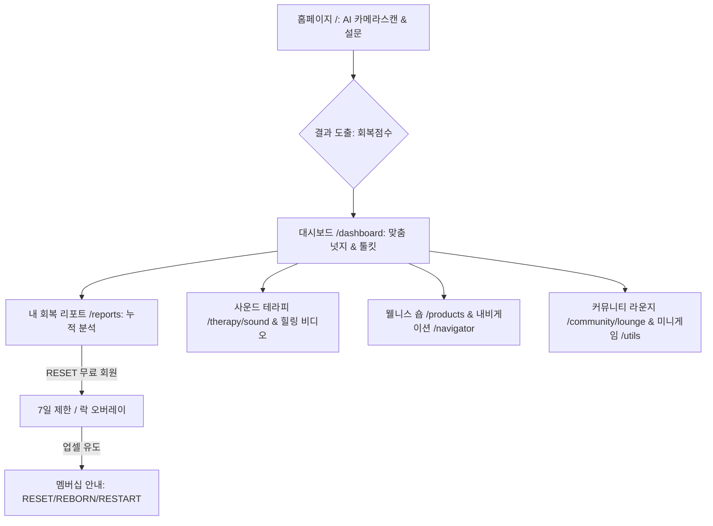
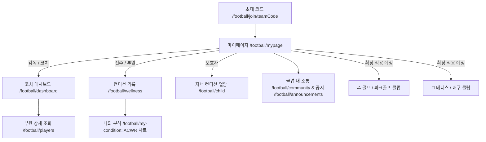

# Youniqle 서비스 전수 페이지 조사 및 유저 플로우 분석 (sitemap_analysis.md)

본 문서는 Youniqle 플랫폼의 사이트맵 설계를 위해 현재 프로젝트(`src/app` 디렉토리 기반 Next.js App Router)의 모든 페이지와 사용자 흐름(User Flow)을 전수 조사한 사전 분석 리포트입니다.

---

## 1. 핵심 유저 플로우 (Core User Journey)

Youniqle 서비스는 크게 **B2C 일반 회원 회복 루프**, **B2B 파트너 및 클리닉 연동 루프**, 그리고 **역할 기반 스포츠 클럽하우스 관리 루프**의 세 가지 주요 흐름을 가지고 있습니다.

### [루프 A] B2C 일반 회원 회복 여정

### [루프 B] 축구 및 생활체육 클럽하우스 전용 웰니스 관리 여정

---

## 2. 홈페이지 내 전체 페이지 전수조사 리스트

각 라우트별 주요 화면 및 화면 내 제공되는 정보와 기능 분석입니다.

### 1) 서비스 소개 및 온보딩 (B2C 기본)
| 페이지 경로 (Route) | 페이지 한글 명칭 | 주요 제공 내용 및 연동 기능 |
| :--- | :--- | :--- |
| `/` | 홈 (메인 랜딩) | 서비스 소개, AI 카메라스캔, 동적 질문 피드백, 회복 점수 리포트 출력 |
| `/about` | 회사 및 서비스 소개 | Youniqle 웰니스 철학, AI 알고리즘 소개, 핵심 팀 소개 |
| `/start` | 서비스 시작 안내 | 신규 회원가입 유도 및 서비스 여정 온보딩 가이드 |
| `/contact` | 고객 지원 및 제휴 문의 | 이메일 제휴 신청, 고객 피드백 전송 양식 |
| `/faq` | 자주 묻는 질문 | 멤버십 결제, 스캔 사용법, 데이터 보안 등 질문 아카이브 |
| `/notices` | 공지사항 목록 | 전체 공지사항 리스트 및 이벤트 안내 |
| `/notices/[id]` | 공지사항 상세 | 선택한 공지사항의 제목, 작성일, 본문 상세 보기 |
| `/privacy` | 개인정보 처리방침 | 개인정보 보호 및 활용 동의 상세 약관 명시 |
| `/terms` | 이용약관 | 서비스 이용 권리 및 책임 규격 명시 |

### 2) 회원 관리 및 계정 관리 (B2C Auth & MyPage)
| 페이지 경로 (Route) | 페이지 한글 명칭 | 주요 제공 내용 및 연동 기능 |
| :--- | :--- | :--- |
| `/auth/signin` | 로그인 | 이메일/소셜 로그인 및 비밀번호 재설정 링크 제공 |
| `/auth/signup` | 회원가입 | 추천인 코드 입력, 이메일 주소 등록, 약관 동의 및 계정 생성 |
| `/auth/forgot-password`| 비밀번호 찾기 | 등록 이메일로 비밀번호 변경 임시 토큰 메일 발송 기능 |
| `/auth/verify-email` | 이메일 인증 | 회원가입 후 토큰 이메일 인증 확인 화면 |
| `/member` | 회원 가입 코드 등록 | 회원 코드 입력 및 유효성 확인 |
| `/member/[code]` | 특정 회원 가입 페이지 | 코드를 통해 사전에 매핑된 설정으로 빠른 회원가입 진행 |
| `/me` | 마이페이지 홈 | 프로필 정보(이름, 이메일, 멤버십 등급), 보유 혜택 스냅샷 |
| `/me/history` | 내 활동 및 측정 기록 | 전체 라이프 스냅 측정 결과 아카이브 및 스캔 날짜별 조회 |
| `/me/coupons` | 보유 쿠폰함 | 적용 가능한 할인 쿠폰 리스트 조회 및 신규 등록 |
| `/me/points` | 회복 포인트 관리 | 일일 미션으로 획득한 포인트 이력 조회 및 전환 |
| `/me/payment-methods` | 결제수단 관리 | 간편 결제 카드 등록, 삭제, 기본 결제 수단 지정 |
| `/me/inquiries` | 나의 1:1 문의 | 접수된 일대일 고객 문의 내역 및 답변 상태 조회 |
| `/me/addresses` | 배송지 주소록 | 웰니스 숍 배송을 위한 주소록 추가, 수정, 삭제 관리 |
| `/me/notifications` | 알림 수신 설정 | 푸시 알림, 이메일 뉴스레터, 야간 시간대 차단 등 옵션 설정 |
| `/me/consultations` | 상담 예약 리스트 | 제휴 의원 및 웰니스 코치와의 비대면/대면 예약 목록 확인 |
| `/me/refunds` | 취소/환불 관리 | 숍 주문 상품 환불 및 멤버십 해지 이력 조회 |
| `/me/delete-account` | 회원 탈퇴 | 서비스 탈퇴 유의사항 확인 및 탈퇴 처리 |

### 3) 회복 분석, 진단 및 리포트 (B2C Recovery Core)
| 페이지 경로 (Route) | 페이지 한글 명칭 | 주요 제공 내용 및 연동 기능 |
| :--- | :--- | :--- |
| `/dashboard` | 메인 대시보드 | 회복 지수, 레이더 차트, AI 오늘의 넛지, 맞춤형 웰니스 툴킷 연동 |
| `/ai-navigator` | 오늘의 리듬체크 | 타임라인 기반 일일 루틴 흐름, 내일의 예보, AI 피드백 요약(AI Advice) |
| `/ai-navigator/report` | 주간 리듬 해석 리포트| 지난 일주일간의 리듬 트렌드 분석, 부족했던 루틴 점검 및 개선 방안 제안 |
| `/reports` | 내 회복 리포트 (허브) | 누적 건강 성장 지표(Stability, Routine), 기간별 로그 리스트(RESET 7일 락) |
| `/reports/daily` | 일일 상세 리포트 | 특정 날짜를 기준으로 정밀 측정된 생체 리듬 데이터와 개선 팁 |
| `/reports/personality` | 심층 성향 리포트 | MBTI 등 간이 분석을 결합한 유저의 회복 성격/기질 유형별 장단점 제시 |
| `/reports/scanner` | 스캐너 기록 리포트 | 카메라 스캔을 통해 생성되었던 개별 신체 리포트 상세 보기 |
| `/private-report` | 개인 정밀 분석 리포트 | 개별 맞춤 솔루션이 수록된 정밀 진단 리포트 열람 |
| `/timeline` | 전체 회복 타임라인 | 가입 이후부터 현재까지 기록된 모든 회복 이벤트 시간순 정렬 제공 |
| `/archive` | 7일 챌린지 보관함 | 완주한 7일 챌린지의 과거 이력 및 수집 데이터 자산 인벤토리 관리 |
| `/archive/certificates` | 완주 증명서 보관함 | 유저가 획득한 각 차수별 완주 증명서들의 목록 모음 |
| `/certificate` | 완주 증명서 보기 | 7일 리듬 개선 챌린지 완주를 공식 입증하는 모바일 증명서 출력 |
| `/diagnosis` | AI 리듬 진단 | 60초 설문 질문 응답을 수집하여 실시간 회복 점수를 산정 |
| `/diagnosis/post-op` | 수술 후 상태 진단 | 수술 이력이 있는 유저를 위한 통증 및 부종 특화 사후 설문 조사 |
| `/diagnosis/report` | 진단 결과 요약 리포트 | 리듬 진단 및 스캔을 마친 후 즉시 도출되는 AI 권장 요약 보고서 |

### 4) 멤버십, 패스 및 결제 (B2C Membership)
| 페이지 경로 (Route) | 페이지 한글 명칭 | 주요 제공 내용 및 연동 기능 |
| :--- | :--- | :--- |
| `/basic-plan` | RESET 패스 소개 | 무료 리셋 패스 혜택 상세 및 상위 등급 비교 테이블 제공 |
| `/founder-ticket` | REBORN 패스 소개 | 유료 리본 패스(월 9,900원) 혜택 소개 및 구독 유도 |
| `/premium-plan` | RESTART 패스 소개 | 최고 등급 리스타트 패스(월 29,800원) 전문가 커스텀 혜택 상세 설명 |
| `/membership` | 멤버십 요약 홈 | 현재 유저의 구독 등급 정보 및 추천 패키지 제공 |
| `/membership/shop` | 멤버십 이용권 구매처 | 패스권 신규 구매 및 연간/월간 정기결제 옵션 선택지 노출 |
| `/membership/[id]` | 개별 멤버십 등급 상세 | 특정 이용권의 혜택 및 상세 주의사항 명시 |
| `/membership/[id]/checkout`| 멤버십 구독 결제 | 카드 정보 입력 및 멤버십 정기구독 처리 페이지 |
| `/navigator-pass` | 내비게이터 패스 소개 | 정밀 오프라인 매칭 케어가 포함된 전담 내비게이터 패스 안내 |
| `/pass-preview/[id]` | 이용권/패스 미리보기 | 구매 결정 전 멤버십 및 웰니스 패스의 주요 혜택 미리보기 슬라이드 |

### 5) 힐링 서비스 및 커머스 (B2C Wellness & Shop)
| 페이지 경로 (Route) | 페이지 한글 명칭 | 주요 제공 내용 및 연동 기능 |
| :--- | :--- | :--- |
| `/therapy/sound` | 자가 사운드 테라피 | 자연음, 명상 주파수, 백색소음 재생 및 3D 리버브, 뇌파 동조 인터페이스 |
| `/healing-center` | 힐링 센터 메인 | 전체 뇌파 동조 음원 리스트 및 힐링 가이드 동영상 큐레이션 허브 |
| `/products` | 웰니스 숍 메인 | 추천 상품 큐레이션, 카테고리별 웰니스 도구(물리치료 소품 등) 쇼핑 |
| `/products/shop` | 웰니스 숍 상품 목록 | 필터링 및 정렬 기능을 제공하는 전체 쇼핑 상품 검색 리스트 |
| `/products/[id]` | 상품 상세 정보 | 제품 사진, 상세 설명, 유저 리뷰 목록, 장바구니/바로구매 버튼 |
| `/cart` | 장바구니 | 구매 대기 중인 상품 목록, 수량 조절, 예상 결제 금액 확인 및 결제 이동 |
| `/checkout` | 결제 페이지 | 주문자 정보 입력, 배송지 선택, 쿠폰/포인트 적용, 모의 결제 연동 |
| `/order-success` | 결제 완료 | 주문 승인 결과, 주문번호, 예상 배송일 안내 및 대시보드 복귀 |
| `/order-failed` | 결제 실패 | 결제 진행 중 오류 원인 표기 및 재결제 유도 |
| `/order-cancelled` | 주문 취소 확인 | 주문 취소가 정상적으로 처리되었음을 안내하는 페이지 |
| `/orders` | 주문 내역 조회 | 이전 결제한 주문 리스트, 배송 현황, 반품/환불 버튼 제공 |
| `/orders/[id]/refund` | 주문 환불/교환 접수 | 특정 주문에 대한 반품 사유 선택 및 환불 접수 양식 |
| `/orders/[id]/tracking` | 배송 추적 현황 | 송장 번호 조회를 통한 실시간 배송 프로세스 지도 및 요약 정보 제공 |
| `/wishlist` | 찜한 상품 목록 | 숍 서핑 중 유저가 하트를 눌러 보관한 위시리스트 모음 |

### 6) 커뮤니티, 갤러리 및 소통 (B2C Community & Gallery)
| 페이지 경로 (Route) | 페이지 한글 명칭 | 주요 제공 내용 및 연동 기능 |
| :--- | :--- | :--- |
| `/community` | 커뮤니티 홈 | 최근 트렌드 피드, 베스트 회복 일지, 공지사항 하이라이트 |
| `/community/lounge` | 회복 라운지 (자유게시판) | 유저 간의 일상 및 회복 과정 소통, 댓글, 좋아요 피드백 |
| `/community/media` | 미디어 공유 게시판 | 이미지 및 운동 쇼츠 영상 중심의 건강 챌린지 공유 커뮤니티 |
| `/gallery` | 갤러리 홈 | 웰니스 미디어 아트 및 제휴 아티스트 작품 전시관 |
| `/gallery/artists` | 참여 아티스트 명단 | 마인드 힐링 및 미디어 아트 전시에 참여한 작가 프로필 리스트 |
| `/gallery/artists/[id]` | 아티스트 상세 프로필 | 아티스트 약력 및 대표 연동 작품 목록 조회 |
| `/gallery/artworks` | 전체 미디어 작품 목록 | 마음을 안정시키는 사운드&아트 융합 디지털 작품 리스트 |
| `/gallery/artworks/[id]` | 작품 상세 감상 | 선택한 아트워크의 고화질 미디어 재생 및 작가 해설 제공 |
| `/chat` | AI 헬퍼 채팅 | AI 상담사와의 대화를 통해 웰니스 고민 해결 및 가이드 안내 |
| `/trainer` | 전담 코치/트레이너 찾기 | 1:1 건강 지도를 해줄 검증된 트레이너 명단 조회 및 매칭 신청 |

### 7) 웰니스 자가 진단 및 웹 유틸리티 (B2C Utilities & Mini Games)
| 페이지 경로 (Route) | 페이지 한글 명칭 | 주요 제공 내용 및 연동 기능 |
| :--- | :--- | :--- |
| `/utils` | 웰니스 도구함 | 건강 및 힐링에 유용한 각종 웹 유틸리티 미니앱 목록 |
| `/utils/todo` | 데일리 웰니스 투두 | 매일 실행할 건강 체크리스트 작성 및 완료 체크 |
| `/utils/bmi` | BMI 체질량지수 계산기 | 신장과 체중을 입력하여 간편 비만도 판별 및 행동 요령 제공 |
| `/utils/breathing` | 호흡 테라피 가이드 | 4-7-8 호흡 등 조절 바에 맞춘 호흡 훈련 인터랙티브 모듈 |
| `/utils/mbti` | 성향 간이 테스트 | 회복 타입 판별을 위한 웰니스 맞춤 MBTI 12문항 검사기 |
| `/utils/food-scanner` | AI 음식 분석기 | 먹을 음식 사진을 업로드해 칼로리와 영양성분을 예측하는 스캐너 |
| `/utils/weather` | 날씨 기반 힐링 추천 | 현재 위치 날씨 API 연동에 기반한 의복, 활동, 힐링 사운드 자동 추천 |
| `/utils/memo` | 회복 감정 일지 | 생각이나 감정을 자유롭게 남기는 데스크탑 메모 패드 |
| `/utils/dday` | 디데이 카운터 | 수술 후 회복일수나 건강 목표일수(예: 금연 100일) 설정 |
| `/utils/qr` | QR코드 제너레이터 | 제휴 클리닉 이용권이나 추천 링크 모바일 전송용 QR 생성 |
| `/utils/remove-bg` | 이미지 배경 제거 | 챌린지 사진 업로드용 누끼 따기 웹 도구 (On-device WebAssembly) |
| `/utils/currency` | 해외 통화 환율 변환 | 글로벌 치료 센터 결제 및 해외 영양제 직구 환산용 계산기 |
| `/utils/unit` | 단위 변환기 | 인치/센티미터, 파운드/킬로그램 등 신체 규격 상호 변환기 |
| `/utils/compress` | 이미지 용량 압축 | 서버 업로드 전 모바일 촬영 사진 고품질 경량화 유틸리티 |
| `/analysis/video` | AI 자세 체형 분석기 | 카메라 촬영 스냅샷으로 거북목(목 각도) 및 양쪽 어깨 밸런스 측정 |
| `/founder-lab/sunnudge` | 선넛지 자외선 솔루션 | 위치/기상청 API 연동을 통한 일일 적정 햇볕 노출 가이드 및 알림 |
| `/stem-cell-prf` | 프리미엄 안티에이징 솔루션 | SVF 줄기세포와 자가혈액 PRF 복합 요령 및 제휴 병원 연계 소개 |
| `/utils/minigames` | 정서 안정 미니게임 | 인지 스트레스 해소를 위한 퍼즐 및 단순 보드게임 모음 |
| `/utils/minigames/2048` | 2048 게임 | 정서적 흐름 전환용 숫자 타일 퍼즐 게임 |
| `/utils/minigames/bingo` | 건강 습관 빙고 | 일상 속 건강 미션 단어들을 모아 맞추는 빙고판 |
| `/utils/minigames/difference`| 숨은 그림 찾기 | 집중력을 환기시키는 숨은 그림 및 다른 부분 찾기 판 |
| `/utils/minigames/emoji` | 이모지 짝 맞추기 | 기억력 감퇴 방지 및 뇌 이완용 이모지 쌍 맞추기 카드 |
| `/utils/minigames/ladder` | 사다리 타기 | 오늘 할 힐링 액션(차 마시기, 걷기 등) 무작위 추첨 사다리 |
| `/utils/minigames/memory` | 카드 암기 게임 | 규칙에 맞춰 카드의 문양을 뒤집고 정답을 맞추는 두뇌 트레이닝 |
| `/utils/minigames/roulette` | 힐링 룰렛 돌리기 | 오늘의 차(Tea) 또는 오늘의 명상 추천 무작위 룰렛 |
| `/utils/minigames/typing` | 타자 속도 측정 | 마음을 정화시키는 힐링 명구를 읽으며 타이핑하는 타자 연습기 |

### 8) 오프라인 지점 및 파트너사 연동 (B2B Partner & Clinics)
| 페이지 경로 (Route) | 페이지 한글 명칭 | 주요 제공 내용 및 연동 기능 |
| :--- | :--- | :--- |
| `/partners` | 전체 파트너 지점 목록 | 플랫폼에 제휴된 의원, 한의원, 테라피 숍 전체 리스트 조회 |
| `/partner/login` | 파트너 로그인 | 제휴사/지점 전용 로그인 포털 |
| `/partner/dashboard` | 파트너 대시보드 | 지점 예약률, 오늘 내방 예상 환자 수, 매출 및 재고 경보 요약 |
| `/partner/analytics` | 지점 운영 분석 통계 | 월간 예약 변화 추이, 서비스별 인기 통계, 순수익 지표 분석 |
| `/partner/products` | 제공 제품/서비스 관리 | 지점 내에서 제공하는 클리닉 코스, 스파 코스 추가 및 수량 편집 |
| `/partner/orders` | 예약/오더 리스트 관리 | 고객 예약 신청 승인/취소 및 대기자 타임라인 모니터링 |
| `/partner/scan` | QR 코드 리프레시 | 지점 내방 고객의 패스/티켓 모바일 확인 및 사용 처리 스캔 |
| `/partner/settings` | 파트너 정보 관리 | 상호명, 위치 정보, 연락처, 제휴 수수료 정산 계좌 세팅 |
| `/partner/settlements` | 월간 정산 관리 | 매월 발생한 서비스 비용 정산 내역서 조회 및 세금 계산서 발급 |
| `/partner/inventory` | 물류/재고 관리 | 숍 내부 판매용 상품 및 치료실 소모품 입출고 내역 |
| `/partner/apply` | 신규 지점 파트너 신청 | 신규 의원/힐링숍 제휴 문의 및 가입 심사 제출 |
| `/clinic/patient/[userId]`| 환자 회복 진료 차트 | 의료진 전용 페이지. 유저의 생체 리듬 데이터와 수술 이력 열람 차트 |
| `/offline` | 오프라인 센터 안내 | 전국 제휴 스포츠 힐링 센터 및 라운지 공간 상세 위치 지도 안내 |

### 9) 시스템 관리자 (Super Admin)
| 페이지 경로 (Route) | 페이지 한글 명칭 | 주요 제공 내용 및 연동 기능 |
| :--- | :--- | :--- |
| `/admin/login` | 최고 관리자 로그인 | 본사 관리자 로그인 세션 관리 |
| `/admin/dashboard` | 통합 관리 대시보드 | 일일 가입자, 총 거래액(GMV), 미처리 파트너 신청 및 1:1 문의 누적수 |
| `/admin/users` | 회원 통합 관리 | 가입된 전체 회원 리스트 조회, 멤버십 등급 강제 조정 및 탈퇴 조치 |
| `/admin/content` | 회복 콘텐츠 허브 | AI 질문 테마 관리, 주간 템플릿 배포, 자가 호흡/사운드 트랙 데이터베이스 등록 |
| `/admin/analytics` | 코호트 & 매출 데이터 | 유저 리텐션 분석, 마케팅 채널 유입 기여도, LTV 시뮬레이션 지표 |
| `/admin/coupons` | 프로모션 쿠폰 발행 | 할인 코드, 정액/정률권 생성 및 만료일 지정, 자동 배포 규칙 설계 |
| `/admin/inquiries` | 고객 센터 통합 관리 | 1:1 문의글 취합 및 본사 CS 상담사 답변 작성 연동 |

### 10) 유소년 축구 클럽하우스 및 생활체육 확장 (Sports Clubhouse)
| 페이지 경로 (Route) | 페이지 한글 명칭 | 주요 제공 내용 및 연동 기능 |
| :--- | :--- | :--- |
| `/football/mypage` | 클럽하우스 마이페이지 | 축구 클럽 사용자 중심 메인 허브. 초대 코드로 팀 가입, 감독/코치용 팀 개설/창단 신청, 역할별(감독/선수/학부모) 맞춤 메뉴 노출 |
| `/football/dashboard` | 코치 스쿼드 대시보드 | 코치 전용. 오늘 소속 선수들의 웰니스 체크 상태(경고/주의/양호/미체크) 모니터링, RPE 세션 부하 및 평균 스쿼드 점수 요약 |
| `/football/announcements` | 팀 공지사항 | 소속 팀의 주요 전달 사항 확인 (코치는 작성 및 수정 권한 보유) |
| `/football/child` | 자녀 컨디션 열람 | 학부모(보호자) 전용. 자녀의 매일 웰니스 건강 지표 및 훈련 피로 분석 내역 조회 |
| `/football/my-condition` | 나의 컨디션 분석 | 선수 전용. 7일 및 장기 웰니스 트렌드 분석 차트, 급만성 훈련 부하 비율(ACWR) 시각화 데이터 제공 |
| `/football/wellness` | 오늘의 컨디션 체크 | 선수 전용 데일리 웰니스 입력창. 수면, 통증, 피로, 스트레스, 기분 상태(5점 만점) 및 RPE 운동 자각도 기록 |
| `/football/schedule` | 팀 스케줄 | 훈련, 경기 및 팀 이벤트 일정 캘린더 조회 |
| `/football/subscription` | 팀 멤버십 구독 관리 | 코치 전용. 팀 단위 정기 요금제 선택, 결제 수단 및 청구 상세 관리 |
| `/football/players` | 소속 선수 명단 | 코치 전용. 소속 선수 상세 정보(역할, 포지션, 등번호) 및 개별 누적 건강 차트 모니터링 |
| `/football/join/[teamCode]` | 팀 참여 링크 | 초대 코드를 통한 동적 팀 가입 요청 페이지 |
| `/football/community` | 팀 소통 커뮤니티 | 소속 클럽 회원들 간의 비공개 피드, 댓글, 좋아요 교류 게시판 |
| `/coach/dashboard` | 코치 전용 종합 관리 | 개별 코치 관리 대시보드 및 지표 관리 |
| `/admin/football/teams` | 관리자 팀 통합 관리 | 어드민 전용. 등록된 축구팀 리스트 조회 및 신규 창단 승인/해제 관리 |
| `/admin/football/stats` | 관리자 클럽 통계 분석 | 어드민 전용. 축구 클럽 전체 이용 지표 및 웰니스 위험 선수 비율 통계 차트 제공 |

> [!IMPORTANT]
> **[생활체육 확장성 설계 (Multi-Sport Extension Architecture)]**
> 현재 구현된 축구 클럽하우스(`/football`) 서비스 모델은 향후 **골프(Golf), 파크골프(Park Golf), 테니스(Tennis), 배구(Volleyball)** 등 다양한 생활체육 동호회 및 클럽 관리 시스템으로 즉시 확대 적용할 수 있도록 확장성을 고려하여 모듈화되었습니다.
> - 역할 기반 분기(코치/선수/학부모), 스케줄 관리, RPE 기반 피로 모니터링 모듈은 타 스포츠 종목의 부하 분석으로 쉽게 이식될 수 있습니다.

---

## 3. 사이트맵 설계를 위한 특이 사항 및 연동 관계

1.  **AI Navigator 및 AI Life Snap**:
    *   홈 화면(`/`)의 카메라 스캔에서 직접 데이터를 생성하고 `/api/scan/save`로 전달되어 `/dashboard`의 차트에 실시간으로 업데이트되는 관계입니다.
2.  **Access Control**:
    *   `/reports`와 `/ai-navigator`는 유저의 멤버십 등급(`RESET`, `REBORN`, `RESTART`)에 맞춰 접근 가능 범위와 데이터 열람 기간이 제한적으로 통제되며, 업셀 다이얼로그로 유기적으로 연결됩니다.
3.  **B2C / B2B 연결**:
    *   B2C 회원이 숍 예약 시 B2B 지점(`/partner/orders`) 및 의료진 진료 차트(`/clinic/patient/[userId]`)로 예약 정보가 고스란히 동기화되는 실시간 백엔드 연결 구조를 가집니다.
4.  **축구 클럽하우스 데이터 유기적 연동**:
    *   선수가 `/football/wellness`에서 데일리 컨디션을 등록하면 즉시 DB 모델(`WellnessCheck`)에 적재되고, 이는 코치 대시보드(`/football/dashboard`)의 스쿼드 오버뷰 및 피로 경보(경고/주의/양호)에 실시간 반영됩니다.
    *   학부모(보호자) 계정은 `/football/child`를 통해 자녀 계정의 컨디션 데이터를 보안이 보장된 상태로 함께 열람할 수 있습니다.
    *   누적된 훈련 자각도(RPE)를 바탕으로 선수 본인 또는 코치는 `/football/my-condition`에서 급만성 훈련 부하 비율(ACWR, Acute:Chronic Workload Ratio)을 조회하여 부상 위험을 조기 진단 및 회피할 수 있는 웰니스 사이클을 구축하고 있습니다.
